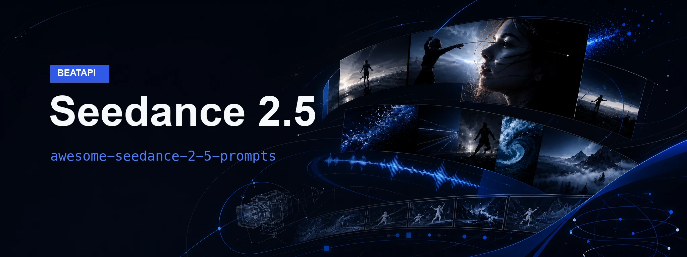
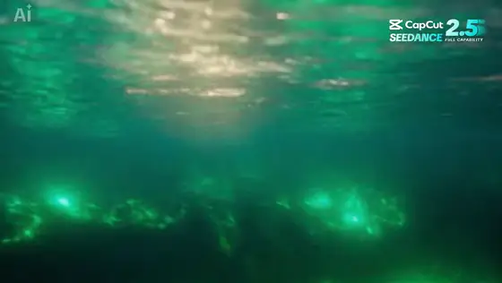
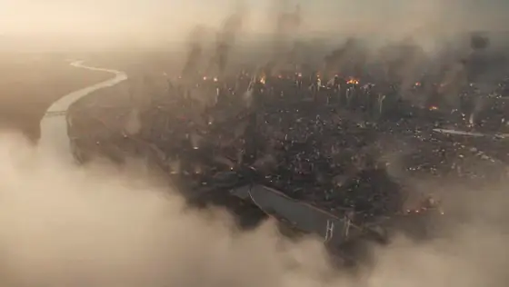
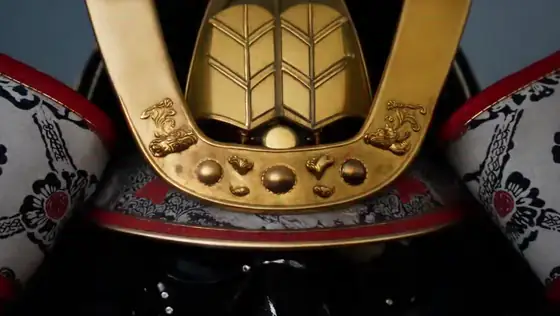
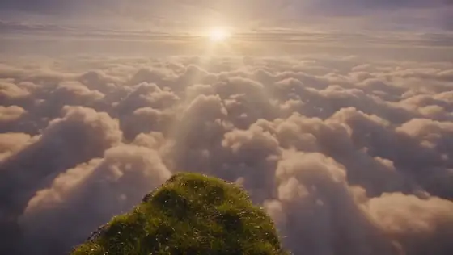
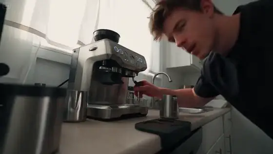

  

# Awesome Seedance 2.5 Prompts

Source-backed Seedance 2.5 video prompts with WebM examples and creator
attribution, curated by [BeatAPI](https://beatapi.io).

**[Browse the live prompt gallery](https://beatapi.io/seedance-2-5-prompts)** ·
**[Use Seedance 2.5 via API](https://beatapi.io/seedance-2.5-api)** ·
**[中文说明](./README.zh-CN.md)** ·
**[Contribute a prompt](https://github.com/BeatAPI/awesome-seedance-2-5-prompts/issues/new?template=prompt.yml)**

## Quick guide

**Map references → Direct the timeline → Lock continuity.** Give each image,
video, or audio input one clear job; then describe what happens and what must
remain consistent.

[BytePlus official prompt guide](https://docs.byteplus.com/en/docs/ModelArk/2607689) ·
[BeatAPI practical guide](https://beatapi.io/blog/seedance-2-5-guide) ·
[Browse all 300 prompt + video examples](./prompts/README.md)

## Prompt gallery

<!-- GENERATED_VIDEO_GALLERY_START -->

**Browse by use case:** [Stories & Films](./prompts/use-cases/stories-films.md) · [Action & Fantasy](./prompts/use-cases/action-fantasy.md) · [Ads & Products](./prompts/use-cases/ads-products.md) · [Music & Performance](./prompts/use-cases/music-performance.md) · [Vlog & Social](./prompts/use-cases/vlog-social.md)

### 1. Vietnamese Mythic Sea Battle

<strong>Prompt</strong> — [Phần 1: Character] + Nhân (young man, @referance image): A rustic Vietnamese peasant with sun-bronzed skin, wearing simple dark linen garments, showing deep resilience and...

~~~~text
[Phần 1: Character]
+ Nhân (young man, @referance image): A rustic Vietnamese peasant with sun-bronzed skin, wearing simple dark linen garments, showing deep resilience and bravery.
+ Hắc Thần Điểu (mythical giant bird @referance image ): A colossal guardian bird of prey with jet-black feathers, a razor-sharp golden beak, and piercing, glowing red eyes.
+ Giao Long (mythical sea monster): Serpentine dragon-like sea creatures covered in dark green scales with vibrant bioluminescent green patterns and glowing eyes.

[Phần 2: Bối cảnh]
An ancient mythical Vietnamese seascape during a raging tempest, dominated by towering limestone karsts rising majestically from a turbulent, bioluminescent green ocean. The environment is devoid of any modern structures, filled only with untamed waters, dark ominous storm clouds, and a mythical atmosphere of a forgotten folkloric era.

[Phần 3: Phong cách đoạn video]
Cinematic 8K video style with hyper-realistic textures and dynamic dark-fantasy atmosphere. The color palette features deep ocean blues, stormy charcoal greys, and dramatic contrast from the vibrant bioluminescent green of the sea creatures and the divine gold energy of the mythical bird. High-speed action cinematography with dramatic slow-motion, dynamic tracking shots, shutter angle matching intense action, organic film grain, and realistic water simulation with volumetric splashes and heavy atmosphere.

[Phần 4: Shot-by-shot]
Shot 1 (2s):
POV moving rapidly upward from deep underwater towards the surface. Looking through the murky, bubbling green water, the glowing silhouettes of giant Giao Long swirl below, creating a sense of thalassophobia. Above the water's surface, the dark silhouette of Hac Than Dieu 📷is visible from behind, flying in place with Nhan r📷iding on its back, his back turned to the camera. Golden hour stormy light filters through the surface. no dialog

Shot 2 (3s):
Close-up of the bubbling, boiling sea surface glowing with an eerie, underwater green bioluminescence under a dark stormy sky. The atmosphere is strangely silent. A colossal, glowing shadow of Giao Long swirls beneath the waves, then suddenly bursts violently upward from the ocean directly towards the camera, spraying water everywhere. no dialog

Shot 3 (1s):
Close-up of Nhan's panicked face under the flashing stormy light, wind whipping his hair. He sits on the back of Hac Than Dieu, quickly turning his head around to look at the newly emerged sea dragon behind them, his eyes wide with fear. Nhan screams "Cẩn thận!" (dialogue in Vietnamese).

Shot 4 (1s):
Close-up of Hac Than Dieu under the stormy sky, its sharp head snapping around in alarm toward the direction Nhan is looking, its red eyes glowing intensely as it senses the threat. no dialog

Shot 5 (2s):
Wide slow-motion tracking shot. Under a dark, stormy sky, the massive Hac Than Dieu, with Nhan clinging to its feathered back, masterfully tilts its giant black wings to the side, narrowly evading the massive Giao Long's snapping jaws in a near-miss aerial dodge. no dialog

Shot 6 (2s):
Slow-motion close-up of Nhan under flashing lightning, his expression filled with sheer terror as the bird tilts sharply. He grips the thick dark feathers of Hac Than Dieu tightly with both hands, trying his best not to fall off into the ocean below. no dialog

Shot 7 (1s):
Slow-motion extreme close-up of the lunging Giao Long's fearsome mouth, filled with sharp, wet fangs and glowing with green light, snapped open wide, attempting to bite the edge of Hac Than Dieu's massive black wing under the stormy sky. no dialog

Shot 8 (2s):
Slow-motion shot of Hac Than Dieu carrying Nhan on its back. The giant bird performs a breathtaking mid-air barrel roll under the dark, thundering clouds, its body twisting elegantly to dodge the attack. no dialog

Shot 9 (4s):
Wide shot showcasing the majestic landscape of jagged limestone karsts rising from the churning ocean. The bioluminescent green water glows intensely as multiple Giao Long rise and fly up. The camera speed ramps back to normal as Hac Than Dieu escapes the first bite spectacularly, swiftly dodging a second lunging Giao Long, while three more of the sea monsters are seen in the background preparing to lunge at high speed. no dialog

Shot 10 (1s):
Close-up of Hac Than Dieu's head under the stormy sky. The giant bird opens its sharp beak wide, letting out a booming, telepathic command. Hac Than Dieu shouts "Bám chặt!" (dialogue in Vietnamese).

Shot 11 (1s):
Close-up of Nhan. Shifting from initial panic to absolute focus, his face hardens with determination as he locks his grip even tighter onto the dark feathers of Hac Than Dieu under the flashing lightning. no dialog

Shot 12 (1s):
Medium shot under the dark stormy twilight. The first Giao Long, frustrated by its missed attack, turns around aggressively and lunges headfirst directly towards the camera, its glowing green eyes filled with rage. no dialog

Shot 13 (9s):
Medium dynamic continuous shot kết hợp với obit shot. Under the dark stormy sky, Hac Than Dieu carrying Nhan releases a brilliant burst of divine golden energy. Suddenly accelerating, the giant bird rolls in mid-air and strikes the lunging Giao Long's head with its powerful talons, knocking it out of the frame. Instantly, a second Giao Long attacks from the side; Hac Than Dieu swerves swiftly, and Nhan uses the momentum to land a powerful kick on the monster's flank, sending it crashing away. Two more Giao Long attack in tandem; a smooth, dynamic orbiting camera tracks Hac Than Dieu as it weaves through their strikes, diving through a narrow, majestic limestone mountain pass over the sea, leading the camera into a pitch black screen. no dialog
~~~~

**Source:** [@Xizital](https://x.com/Xizital/status/2083117163909710053) · 30s · 16:9 · fantasy

---

### 2. Tokyo Samurai Versus Stone Titan

<strong>Prompt</strong> — A photorealistic live-action 30-second uninterrupted one-shot action sequence, presented in native 16:9 widescreen cinematic format. Designed specifically for a full-width IMAX...

~~~~text
A photorealistic live-action 30-second uninterrupted one-shot action sequence, presented in native 16:9 widescreen cinematic format. Designed specifically for a full-width IMAX composition with an epic sense of horizontal scale. Visual quality comparable to a $350 million Hollywood blockbuster.

The camera is the true protagonist.

A devastated futuristic Tokyo stretches across the horizon. Endless ruined skyscrapers, collapsed highways, burning buildings, thick smoke columns, drifting ash, military helicopters, and distant explosions fill the entire width of the frame.

The opening begins with an enormous ultra-wide aerial establishing shot. The camera dives from the clouds toward the ruined city at breathtaking speed before seamlessly transitioning into an aggressive FPV drone flight.

A lone samurai in realistic black armor stands in the center of an abandoned avenue.

Far in the distance, occupying nearly the entire width of the horizon, a colossal 120-meter stone titan slowly emerges between skyscrapers.

The camera never cuts.

The titan charges.

Every footstep sends shockwaves through multiple city blocks.

The camera accelerates violently.

It flies between skyscrapers, through broken office floors, underneath collapsing bridges, inches above destroyed streets, then suddenly climbs hundreds of meters before diving again.

The camera constantly sweeps horizontally across the city, fully utilizing the 16:9 frame to reveal the immense scale of Tokyo.

Buildings rush past both sides of the frame with massive cinematic parallax.

The samurai sprints through the destruction.

The camera races beside him, then overtakes him, flies backward while tracking his face, performs wide orbit shots, dramatic side tracking shots, sweeping crane movements, low-angle hero shots, extreme wide establishing shots, and breathtaking aerial reveals—all without a single cut.

The samurai runs vertically along a collapsing skyscraper.

The camera follows only inches behind him before swinging outward into an enormous wide shot, revealing the titan filling almost the entire frame.

The camera dives beneath the titan, spirals upward around its massive body, then performs a huge 360-degree orbit as debris, fire, shattered glass, sparks, and smoke explode across the widescreen image.

Natural cinematic camera inertia, realistic handheld momentum, subtle vibration from explosions, dynamic focus pulls, anamorphic lens flares, realistic motion blur, volumetric lighting, HDR, atmospheric haze, practical lighting, physically accurate destruction.

Silence.

The camera slowly pushes toward the samurai.

He assumes an iaido stance.

An explosive burst of movement.

The camera follows the slash in one impossible continuous motion before rapidly pulling back thousands of meters.

The titan freezes.

A glowing cut slowly appears.

The titan splits perfectly in half.

Both halves collapse across the entire width of the city, generating an immense wall of dust that rolls across the skyline.

The final shot is an ultra-wide aerial pullback revealing the burning ruins of Tokyo stretching from edge to edge of the frame, with the lone samurai reduced to a tiny silhouette in the foreground.

Photorealistic live action, IMAX cinematic realism, ultra-detailed environments, massive sense of scale, seamless one-shot, award-winning visual effects, physically believable camera movement, spectacular destruction, emotionally powerful composition, 16:9 optimized, ultra-wide cinematic framing, no text, no subtitles, no watermark.
~~~~

**Source:** [@tanabe_fragm](https://x.com/tanabe_fragm/status/2083098671609241666) · 30s · 16:9 · cinematic action

---

### 3. Samurai and Horse Trailer

<strong>Prompt</strong> — 方向性 甲冑と馬のディテールを高速で見せながら、後半で騎馬武者として完成させる。 前半は緊張感、後半は疾走感。 全体は映画予告編のような迫力のあるテンポで展開する。 0.0〜2.0秒｜強い導入 映像 黒画面から、金色の兜の前立てだけが強い光を受けて浮かび上がる。 カメラ 超クローズアップ。 兜の中央から始まり、0.8秒ほどで急速にプッシュイン。 演出...

~~~~text
方向性 甲冑と馬のディテールを高速で見せながら、後半で騎馬武者として完成させる。 前半は緊張感、後半は疾走感。 全体は映画予告編のような迫力のあるテンポで展開する。

0.0〜2.0秒｜強い導入
映像 黒画面から、金色の兜の前立てだけが強い光を受けて浮かび上がる。

カメラ 超クローズアップ。 兜の中央から始まり、0.8秒ほどで急速にプッシュイン。

演出 金属音に合わせて一瞬だけ白くフラッシュ。 すぐに暗転せず、そのまま次のカットへハードカット。

2.0〜4.0秒｜面頬と眼差し
映像 黒い面頬、目元、兜の下の影を見せる。

カメラ 左斜め下から右上へ高速スライド。 途中でごく短いスピードランプ。

ポイント 顔全体を長く見せず、目元と面頬の質感で強さを出す。

4.0〜6.0秒｜刀の準備
映像 右手が刀の柄を強く握る。 鞘と金具がわずかに揺れる。

カメラ 腰元のマクロショット。 刀の柄に沿って横方向へ高速トラッキング。

演出 金属が擦れる短い効果音。 完全な抜刀はまだ見せない。

6.0〜8.0秒｜馬の登場
映像 馬の前脚が地面を踏み鳴らす。 砂や土が飛ぶ。

カメラ 地面すれすれのローアングル。 蹄を追いながら前方へ移動。

演出 蹄の着地に合わせて画面を小さく揺らす。

8.0〜10.0秒｜馬の顔と手綱
映像 馬が鼻息を吐き、首を振る。 手綱が張る。

カメラ 馬の顔の斜め前から、首筋へ高速パン。 最後に鞍で止める。

ポイント 馬全体ではなく、顔・首・鞍を連続的につないで見せる。

10.0〜12.5秒｜侍と馬が同じ画面に入る
映像 侍が馬の横に立ち、左手で手綱を取る。

カメラ 足元から開始し、兜まで一気にティルトアップ。 最後に少し引いて、侍と馬の全体像を見せる。

演出 風で甲冑の紐、馬のたてがみ、布が揺れる。

12.5〜15.0秒｜騎乗への移行
映像 侍が馬へ乗ろうと踏み込む。

カメラ 侍の背後から高速で接近。 身体が画面を大きく遮った瞬間に、騎乗後の画へ切り替える。

重要 実際の騎乗動作を全部見せない。 身体、旗、砂埃などを画面いっぱいに入れて、自然に状態を切り替える。

15.0〜18.0秒｜騎馬武者の完成
映像 侍が馬上で手綱を握る。 馬がゆっくり歩き始める。

カメラ 馬の左側面から並走するミディアムワイド。 少しローアングルで、騎馬武者を大きく見せる。

演出 ここだけ一瞬テンポを落とし、完成した姿を見せる。

18.0〜20.5秒｜正面突進
映像 馬が歩行から速歩へ移行し、正面へ向かってくる。

カメラ 正面ローアングル。 カメラは後退しながら馬を追う。

ポイント 馬と侍を画面中央に固定し、背景だけが高速で流れるように見せる。

20.5〜23.0秒｜横方向の疾走
映像 騎馬武者が画面左から右へ駆け抜ける。

カメラ 高速サイドトラッキング。 一瞬だけ馬の脚、甲冑、刀をクローズアップで差し込む。

編集感 0.5〜0.8秒の短いカットを3つ入れる。

馬の脚

侍の手

甲冑の揺れ

23.0〜25.5秒｜抜刀
映像 侍が右手で刀を抜く。 刀身が光を反射する。

カメラ 右斜め前から半円状に回り込む。 抜刀と同時に速度を上げる。

演出 刀身が画面を横切った瞬間にワイプのように次のカットへ移行。

25.5〜28.0秒｜ヒーローショット
映像 丘の上で馬が立ち止まり、侍が刀を構える。 背後に朝日、霧、旗。

カメラ 背後の低い位置からゆっくり上昇。 騎馬武者をシルエット気味に見せる。

ポイント ここは高速ではなく、2.5秒かけて余韻を作る。

28.0〜30.0秒｜締め
映像 侍が刀を下ろし、馬が一歩前へ出る。 砂埃が画面を覆う。

カメラ 正面のミディアムロング。 最後の一歩に合わせて急速にプッシュイン。
~~~~

**Source:** [@akiyoshisan](https://x.com/akiyoshisan/status/2083096891085213987) · 30s · 16:9 · cinematic action

---

### 4. Summer Resort Waterslide Vlog

<strong>Prompt</strong> — 女主角。 所有片段中，必须完全保持她的面部特征，包括眼型、鼻子、嘴型、脸部轮廓以及发色一致。即使每个镜头的拍摄角度发生变化，也必须让人明确识别为同一个人物。 服装不固定参考@图片，每个片段的穿搭必须严格按照对应的文字指令执行。 忽略 @图片 中的背景、人物姿势以及画面底部文字。 ② 主体与空间 盛夏度假酒店独自旅行 Vlog。 人物依次经过： 酒店客房 →...

~~~~text
女主角。 所有片段中，必须完全保持她的面部特征，包括眼型、鼻子、嘴型、脸部轮廓以及发色一致。即使每个镜头的拍摄角度发生变化，也必须让人明确识别为同一个人物。  服装不固定参考@图片，每个片段的穿搭必须严格按照对应的文字指令执行。 忽略 @图片 中的背景、人物姿势以及画面底部文字。  ② 主体与空间  盛夏度假酒店独自旅行 Vlog。  人物依次经过：  酒店客房 → 阳台 → 酒店水上乐园 → 大型滑水道 → 落水池。  所有场景都位于同一家度假酒店内。从客房阳台可以清楚俯瞰楼下的室外水上乐园。阳台视角中必须能看到青绿色的落水池、浅水娱乐区、遮阳伞以及一条醒目的大型开放式滑水道。后续真正进入的水上乐园、滑水道和落水池，必须与阳台中看到的场景保持同一空间关系与结构连续性。  季节为夏季。  服装分为两个阶段：  前半段（0–4 秒）：轻便的夏季休闲装。  后半段（4–15 秒）：简约的黑色比基尼。  每个片段只能穿该片段指令中指定的服装，同一片段内服装不得发生变化。  4–15 秒期间，女主不佩戴墨镜、帽子或手持任何道具。  ③ 时间线  总时长 0–15 秒，共 7 个片段。每个片段只包含一个核心动作，不得擅自合并或省略任何镜头。  0–2 秒【抵达／客房】  明亮的度假酒店客房，以白色亚麻材质、浅色木质家具和米白色软装为主，午后阳光从阳台方向洒入室内。  女主穿着轻薄的亚麻衬衫和短裤，拉着行李箱走进房间。  以前置手持广角自拍近全身镜头开始，镜头快速向她推近。她对着镜头明亮、开心地说道：  “终于开始夏日假期啦！”  2–4 秒【展示景色／阳台】  继续保持相同的夏季休闲穿搭。  先拍摄手拉开白色窗帘的特写镜头，随后焦点快速转移到阳台落地玻璃窗外、位于楼下的酒店水上乐园。画面中清楚展示大型开放式滑水道的弯道结构以及连接的落水池。  紧接着快速切换到她转过身的面部反应镜头。她看到滑水道后，眼睛微微睁大，嘴角扬起，露出惊喜、兴奋、迫不及待想去玩的表情。  4–6 秒【进入水上乐园／园区步道】  女主换为简约的黑色比基尼，赤脚，头发保持干燥。  手持摄影机跟随她进入酒店水上乐园。她沿着湿润的园区步道快步走向刚才从阳台看到的那条大型滑水道。画面随着她的脚步产生自然起伏和晃动，背景中的热带植物、浅水区、遮阳伞与闪闪发光的水面从她身后掠过，滑水道始终位于她前进方向的画面中。  6–8 秒【登上滑道／滑道入口】  继续保持黑色比基尼，头发仍然是干燥状态。  这一段为快速连续动作蒙太奇，但核心动作必须明确是：登上滑道并坐入入口准备出发。  先拍摄她赤脚踩上湿润台阶的脚部特写，再快速切换到她扶着栏杆向上登阶的动作，随后切到滑道顶部入口。她到达顶端后转身坐入大型开放式滑水道入口，双腿自然向前，双手扶在身体两侧，摆出稳定、正确的人体滑水姿势。  正面近景拍摄她紧张又兴奋的表情。她看着镜头，清楚地说道：  “我要滑下去啦！”  8–11 秒【高速下滑／滑水道内部】  女主沿同一条大型开放式滑水道快速下滑。  使用固定在滑道前方、朝向女主上半身和面部的防水广角机位拍摄整个滑水过程，机位保持统一，不随意切换成其他角度。清楚表现她在滑道中高速前进。  滑道连续经过一到两个清晰弯道，人物身体随着弯道自然左右倾斜，头发被气流与水流带动，脸上出现真实、兴奋的笑容与短促惊呼。阳光、阴影和飞溅的水珠快速掠过画面。  整个过程中她必须始终贴合滑道，不得悬浮、翻转、飞起或突然脱离滑道。  11–13 秒【冲入落水池／滑道出口】  继续保持黑色比基尼。  镜头切换到滑道出口正前方、接近水面的固定防水低机位。她从滑道出口高速冲入落水池，身体完整冲进水中，溅起巨大、真实的水花。水花正面覆盖摄影机镜头，几滴水珠留在镜头表面。  她入水后短暂消失在水下，不能在冲出滑道后立刻站起或直接停在水面上。  13–15 秒【结尾／落水池内】  她从水中自然浮出，此时头发已经完全湿透。  她先用双手将湿透的头发向后梳起。  然后快速完成三个连续镜头：  正面近景：她闭眼将湿发向后梳起，水珠顺着脸部和肩膀流下。  侧面近景：湿发贴着脸颊与颈侧，水珠继续滑落，她微微转头。  回到正面近景：她重新看向镜头，自然笑出来，画面定格在最后一帧。  镜头表面的水珠继续保留，不要消失。  ④ 摄影机与音频  摄影机：  使用每 0.5–1 秒快速切换镜头的剪辑节奏。  整体保持手持 iPhone 拍摄质感。  16:9 横屏画幅。  混合使用推近、拉远和向上倾斜镜头。  客房、阳台、水上乐园步道部分保留自然的手持晃动、自动对焦寻找焦点的过程，以及室外阳光直射时曝光轻微波动的效果。  滑水道内部与滑道出口部分使用真实防水广角机位，保证贴近水面、速度感强、镜头带有少量水珠冲击感。  音频：  不添加背景音乐。  分层加入真实环境声音，包括：  行李箱轮子滚动声  拉开窗帘的摩擦声  阳台外远处传来的水上乐园水声  蝉鸣声  赤脚踩在湿润地面的声音  园区环境中的流水声与回响  登台阶时的脚步声  滑水道内部持续增强的水流声  高速下滑时的风声与飞溅水声  冲入落水池的巨大落水声  从水中浮出后自然爆发出的笑声  所有对白必须使用自然、清晰的中文普通话。人物口型、发音节奏、情绪和中文台词必须准确同步。不得生成韩语、英语或其他语言，不得自行增加旁白、解释性对白或无关喊话。  ⑤ 风格与限制  整体采用盛夏明亮、充满活力的自然光色调，加入轻微的胶片质感，呈现 Instagram 旅行 Vlog 氛围。  保留真实的皮肤质感，包括毛孔、细碎发丝、自然的皮肤油脂光泽，以及后半段真实的水珠、湿发与湿润皮肤状态。  禁止使用美颜滤镜，禁止出现 CG 或过度人工化的皮肤质感。  不得擅自合并镜头或省略任何场景。  不出现换衣服的过程。  4–11 秒之间头发必须保持干燥，只能被风吹动；11 秒之后冲入落水池，头发和身体才完全湿透。  阳台看到的水上乐园、后续进入的水上乐园、大型滑水道和落水池必须保持完全一致的空间连续性，不得突然更换场地或设施结构。  滑水道必须始终是同一条大型开放式人体滑水道，不得突然变成封闭管道、双人滑道或其他设施。  画面中不得添加任何文字。
~~~~

**Source:** [@Chengzilhy](https://x.com/Chengzilhy/status/2083096545772405088) · 15s · 16:9 · vlog

---

### 5. Cloud World First-Person Freefall

<strong>Prompt</strong> — immersive surreal cinematic film, hyper-detailed, true-to-life lighting and shadows mixed with impossible physics, rich motion detail, volumetric god rays, anamorphic lenses,...

~~~~text
immersive surreal cinematic film, hyper-detailed, true-to-life lighting and shadows mixed with impossible physics, rich motion detail, volumetric god rays, anamorphic lenses, subtle film grain, masterpiece quality. Immersive multi-shot story with precise timestamp control and native spatial audio:

[0-6s] Extreme first-person POV standing on the edge of a floating cliff made of soft glowing moss. Below is an endless ocean of gigantic, super-fluffy cotton-candy clouds — each cloud the size of a mountain, impossibly soft and billowing like living marshmallows. Soft male voice, calm but trembling: “I’ve dreamed of this place my entire life.”

[6-12s] He jumps. Seamless first-person freefall into the giant fluffy clouds. Instead of falling through, he sinks slowly like diving into warm foam. The clouds part and reshape around him into soft tunnels of pink, gold and lavender. Impossible physics: gravity flips gently mid-fall. Soft voice (awed): “They’re soft… they’re alive…”

[12-18s] He emerges inside a vast floating world made entirely of living clouds and translucent crystal islands. Giant fluffy cloud whales swim slowly through the sky. Soft glowing staircases of solid mist rise and fall. He lands on a cloud bridge that bounces like a trampoline under his feet. Camera orbits him as the entire sky breathes and shifts colors.

[18-25s] He starts running and the cloud bridge launches him into the air. First-person flight through the impossible sky: weaving between mountain-sized fluffy clouds that open like flowers, diving through glowing mist waterfalls that turn into liquid starlight, racing alongside cloud whales that leave trails of sparkling dust. Reality bends — the horizon folds into a spiral.

[25-30s] Final wide crane shot as he soars higher and higher until the entire cloud world forms a giant glowing heart shape around him. Soft voice (peaceful, almost whispering): “I was never falling… I was coming home.”

Hyper-detailed, breathtaking surreal world-building, perfect motion continuity, emotional story of discovery and belonging, immersive first-person hybrid style, native dual-channel audio (soft wind, distant whale-like hums, ethereal music swell, intimate dialogue), pure dream logic, viral awe factor.
~~~~

**Source:** [@zeng_wt](https://x.com/zeng_wt/status/2083096037200220208) · 30s · 16:9 · cinematic story

---

### 6. Morning Coffee Mini-DV Vlog

<strong>Prompt</strong> — CAMERA / LOOK: Handheld mini DV camcorder footage filmed by the subject herself. Slight hand shake, occasional focus hunting, imperfect framing, natural zoom adjustments, soft...

~~~~text
CAMERA / LOOK: Handheld mini DV camcorder footage filmed by the subject herself. Slight hand shake, occasional focus hunting, imperfect framing, natural zoom adjustments, soft tape-like image quality, subtle grain, realistic auto-exposure shifts from bright kitchen morning light. Natural skin tones, mild motion blur, authentic consumer camcorder aesthetic.
STYLE: Cozy coffee-prep vlog with gentle ASMR elements. Relaxed pacing, minimal dialogue, candid moments. Focus on satisfying sounds: bean grinder whirring, portafilter tamping, steam wand hissing, cup clinking, milk frothing.
SUBJECT: Young man in his mid-20s, plain t-shirt, hair slightly tousled, minimal accessories. Calm, focused energy while making his morning coffee.
SETTING: Small kitchen counter with an espresso machine on a bright morning. Natural daylight, coffee beans and a mug nearby, quiet atmosphere.
STORYBOARD:
→ (3s, propped medium shot) Places camera on the counter, switches on the machine. "Morning coffee, the proper way."
→ (3s, overhead shot) Grinds fresh coffee beans, fine grounds falling into the portafilter.
→ (3s, close-up) Tamps the grounds down firmly and evenly.
→ (3s, handheld shot) Locks the portafilter into the machine. "Here we go."
→ (3s, detail shot) Espresso streams slowly into a small cup. No dialogue.
→ (3s, medium shot) Pours cold milk into a small steel pitcher. "Time for the milk."
→ (3s, macro shot) Steam wand hissing as it froths the milk.
→ (3s, propped shot) Pours frothed milk carefully over the espresso, forming light layers.
→ (3s, warm ending shot) Holds the finished cup, takes a small sip, satisfied smile. "That's exactly what I needed."
→ (3s, final shot) Reaches toward camera, still holding the cup. "See you later." Hand covers lens as recording ends.
AUDIO NOTES: Natural kitchen ambience — grinder whirring, tamping, steam hissing, milk pouring should be clearly audible. Dialogue quiet and casual.
REALISM NOTES: Authentic body language, natural blinking, genuine focused smiles, occasional careful pauses while pouring, imperfect framing, focus breathing, bright morning light shifts. Should resemble a genuine personal coffee vlog on a consumer camcorder, not a commercial or AI-generated production.
~~~~

**Source:** [@Strength04_X](https://x.com/Strength04_X/status/2083094742682787939) · 30s · 16:9 · vlog

---

### 7. Seedance 2.5

<strong>Prompt</strong> — Create a 30-second ultra-realistic dark tokusatsu transformation sequence using the reference image as the heroine. She stands in an apocalyptic wasteland beneath a smoky...

~~~~text
Create a 30-second ultra-realistic dark tokusatsu transformation sequence using the reference image as the heroine.

She stands in an apocalyptic wasteland beneath a smoky gray-blue sky, surrounded by ruins, ash, and distant flying creatures. A matte-metal ring with a glowing golden crystal is visible on her finger. Use one continuous cinematic handheld shot with an IMAX-scale feel.

She slowly raises her hand. Her eyes suddenly glow white-gold as energy cracks through the air. She shouts, “Henshin!”

The crystal shatters, releasing a powerful blue energy burst. Shockwaves distort the air as red smoke, blue lightning, and golden particles race across her body. Her clothes burn away into energy while iridescent biological armor grows over her skin. Metallic plates form and lock together with sparks, followed by an uneven golden horned mask with glowing compound eyes.

Her transformation completes into a flame-gold Thunder Dragon warrior with glowing cracks, heavy armor, horns, and unstable energy pulsing beneath the surface.

She drops into a fighting stance and forms a lightning blade in her hand. After a brief charged pause, she launches forward at extreme speed, smashing into the battlefield. The ground fractures and massive explosions, debris, smoke, lightning, and golden energy erupt across the frame.

Ultra-realistic tokusatsu VFX, cinematic lighting, realistic materials, dynamic camera movement, detailed armor, physically believable particles, dramatic scale, intense transformation effects, seamless continuous motion, epic final impact.
~~~~

**Source:** [@Naiknelofar788](https://x.com/Naiknelofar788/status/2087231217968312407) · 30s · 16:9 · cinematic action

---

### 8. seedance 2.5 on

<strong>Prompt</strong> — Hyperrealistic, photorealistic cinematic video. Static symmetrical wide-angle shot of a starkly empty bedroom with soft daylight. In the center sits a polished, red-and-white...

~~~~text
Hyperrealistic, photorealistic cinematic video. Static symmetrical wide-angle shot of a starkly empty bedroom with soft daylight. In the center sits a polished, red-and-white spherical capture device that wiggles once. Suddenly, it bursts open in a dazzling eruption of golden energy and sparkling particles with cinematic lens flares. From this central pulse, magical streams of light solidify into a bed with yellow creature-themed bedding, a wooden desk, shelves, and various colorful monster plush toys. Framed posters and a glowing lightning-bolt neon sign appear on the walls. The room is instantly transformed into a complete magical sanctuary. Sound effects: soft magical hum, energy burst, and the sound of furniture solidifying.
~~~~

**Source:** [@MaomaoChan__AI](https://x.com/MaomaoChan__AI/status/2087223135326384530) · 8s · 16:9 · cinematic story

---

### 9. PROMPT [Character Reference Mapping] @ Image 1 is [Character Name], use @ Audio 1

<strong>Prompt</strong> — PROMPT [Character Reference Mapping] @ Image 1 is [Character Name], use @ Audio 1 for [her/his] voice and [Accent Name] accent, [she/he] is [Height]. [The Scene Title] Script...

~~~~text
PROMPT

[Character Reference Mapping] @ Image 1 is [Character Name], use @ Audio 1 for [her/his] voice and [Accent Name] accent, [she/he] is [Height].

[The Scene Title] Script Prompt

Global Style: A dark, oppressive, and deeply unsettling cinematic environment reminiscent of the G-Man encounters in Half-Life 2. The lighting is harsh and low-key, with strong chiaroscuro casting deep shadows across the character's face. The lens is a vintage anamorphic 35mm, creating a subtle distortion at the frame edges and an uncomfortable, intense proximity. The color grade is cold, desaturated, and heavy on sickly greens and sterile blues. A dense, flickering projected overlay washes over the character's face and the immediate background, displaying rapid, ghostly montages directly related to [INSERT TOPIC HERE OR IT WILL JUST BE A RANDOM DARK TOPIC]. The background is a pitch-black, non-descript void. The audio loop is a low, vibrating industrial drone, punctuated by the character's erratic, heavy breathing and occasional, deeply disturbing evil chuckles that vibrate directly into the viewer's chest.

[00:00 - 00:04] Shot 1: Tight close-up framing the character's face on the center-right third of the screen. The camera is dead still, forcing an intense, unblinking eye contact with the viewer. A flickering, high-contrast overlay of [INSERT VISUAL THEME RELATED TO TOPIC] projects across their skin and the surrounding environment. The character takes a slow, shuddering, unnaturally heavy breath, their chest rising rigidly. With a piercing, erratic [Accent Name] accent, they deliver the opening line: "[Insert dialogue fragment 1 related to topic]."

[00:04 - 00:08] Shot 2: The camera slowly creeps in closer, shifting slightly to the left third, amplifying the suffocating claustrophobia. The projected overlay intensifies, blurring the line between the character's face and the shifting images of [INSERT VISUAL THEME RELATED TO TOPIC]. The character's expression shifts into a sinister, knowing smirk before they let out a quiet, menacing, and deeply evil chuckle that rattles the microphone. In a low, gravelly whisper, they state: "[Insert dialogue fragment 2 related to topic]."

[00:08 - 00:12] Shot 3: Extreme close-up framing the left third of the screen, focusing on her mouth and jawline. The camera vibrates with a micro-tremor effect. The sodium lighting dims significantly, plunging half her face into absolute, impenetrable darkness. The tracking is microscopic and jittery, mimicking a glitching reality. The projection of [INSERT VISUAL THEME RELATED TO TOPIC] strobes violently across their face, reflecting the chaotic imagery directly in the pupils. Their breathing becomes a slow, deliberate, rhythmic hiss. They speak with brutal, absolute certainty: "[Insert dialogue fragment 3 related to topic]."

[00:12 - 00:16] Shot 4: Smooth camera pan tracking across to the center third as the lighting briefly shifts to a cold, sterile flickering blue backlight. The character tilts their head at an uncanny, unnatural angle, staring past the lens for a split second before snapping their gaze back to the camera. The projection speeds up into a chaotic strobe of [INSERT VISUAL THEME RELATED TO TOPIC]. In a cold, calculated tone, they murmur: "[Insert dialogue fragment 4 related to topic]."

[00:16 - 00:20] Shot 5: A sudden slow-motion zoom pulling back into a medium close-up, framing the character dead center against the void. The projected overlay now bleeds off their silhouette, casting violent green shadows into the empty space behind them. The character leans forward, invading the camera's space, their eyes wide and unblinking. The ambient audio drone drops in pitch, vibrating with low frequency. They lean in and utter: "[Insert dialogue fragment 5 related to topic]."

[00:20 - 00:24] Shot 6: High-angle tight shot tilted down on the right third of the frame. The harsh top lighting accentuates dark, sunken eye sockets as the flickering projection of [INSERT VISUAL THEME RELATED TO TOPIC] sweeps across their forehead like broken film reels. The character lets out another raspy, unsettling laugh that distorts slightly into static. With an unhinged grin, they whisper: "[Insert dialogue fragment 6 related to topic]."

[00:24 - 00:27] Shot 7: An abrupt whip-pan snap to an extreme Macro shot focused entirely on one eye, locked into the left third of the frame. The reflection of [INSERT VISUAL THEME RELATED TO TOPIC] is crystal clear inside the pupil as the iris twitches violently. The ambient audio cuts out completely, leaving only raw, wet breathing. They deliver their final warning in a cracked, low pitch: "[Insert dialogue fragment 7 related to topic]."

[00:27 - 00:30] Shot 8: A sudden, violent digital macro-jitter dynamic camera snap backward. A blinding blast of overexposed projector light washes out the character's features entirely, turning them into a silhouette trapped inside a chaotic swarm of flashing [INSERT VISUAL THEME RELATED TO TOPIC] imagery. The audio distorts into a crushing burst of static and a final, echoing, slowed-down chuckle before abruptly cutting to a pitch-black screen wash.
~~~~

**Source:** [@ObsceneSelene](https://x.com/ObsceneSelene/status/2087215968720486583) · 30s · 62:27 · music video

---

### 10. Fight Night Look

<strong>Prompt</strong> — Seedance 2 提示词。 生成一段15秒超写实电影感近身格斗视频，严格16:9横屏，原生4K，24fps。整体风格为雨夜伊斯坦布尔街头的粗粝新黑色电影动作场面。画面必须像真实真人实拍，不像AI美颜、不像数字人、不像游戏CG。 【素材绑定】 image1 = 第一位人物 / 主角参考。 image2 = 第二位人物 / 攻击者参考。...

~~~~text
Seedance 2 提示词。

生成一段15秒超写实电影感近身格斗视频，严格16:9横屏，原生4K，24fps。整体风格为雨夜伊斯坦布尔街头的粗粝新黑色电影动作场面。画面必须像真实真人实拍，不像AI美颜、不像数字人、不像游戏CG。

【素材绑定】
image1 = 第一位人物 / 主角参考。
image2 = 第二位人物 / 攻击者参考。

使用image1作为主角的脸部、五官比例、发型、发色、皮肤质感、体型比例、年龄感、服装逻辑、鞋子、配饰和整体气质参考。
使用image2作为攻击者的脸部、五官比例、发型、发色、皮肤质感、体型比例、年龄感、服装逻辑、鞋子、配饰和整体气质参考。

两人都是明确成年的女性格斗者。
保持两人的可识别身份，但允许自然真人表情、湿发摆动、呼吸起伏、肌肉紧张、疼痛反应和真实动作变形。
不要把脸固定成僵硬照片。不要做角色设定图、拼贴图、分镜图、标签、文字、边框或面板。

【真人质感要求】
必须避免AI美颜感。
保留自然人类皮肤质感、轻微不对称、真实毛孔、细微眼下纹理、湿发碎发、雨水打湿后的皮肤反光、自然眨眼、下颌紧张、呼吸不稳、肌肉用力和真实疼痛反应。
脸不能像塑料娃娃、不能像数字头像、不能过度磨皮、不能有玻璃眼或过度完美五官。

【场景】
雨后的伊斯坦布尔夜街。整场格斗只发生在这条街上。
街道狭窄而真实，地面湿滑发亮，有水坑、碎石、散落垃圾、停靠车辆、旧建筑墙面、路边栏杆、昏黄街灯、远处霓虹光晕、潮湿雾气和湿润反射。
画面氛围粗粝、危险、冷色雨夜、带有新黑色电影质感。

一辆深色停靠轿车从开头就固定出现在街道右侧或后方可见位置。它必须在整个镜头中保持同一空间位置，最后成为主角被踢飞后撞上的目标。不要让汽车突然出现。

【核心动作原则】
真实近身格斗，不是舞蹈，不是武侠，不是超能力。
每一次攻击都必须有明确因果链：
蓄力 → 出手路径 → 接触或擦过 → 身体反应 → 重心变化。
禁止假打、隔空反应、身体穿模、无原因摔倒、无重量飞行。

动作要快、狠、清楚，但不能混乱。
两人都必须像真实训练过的格斗演员。攻击者更主动、更凶狠；主角一开始冷静、轻蔑、精准，但最后被攻击者重击打飞，处于失败状态。

【摄影】
一个连续手持长镜头，无剪切，无黑屏转场，无瞬移。
摄影机路径必须清楚：
主角肩后OTS开场 → 自然移动到侧面轮廓近景 → 近身格斗环绕跟拍 → 跟随主角被踢飞的方向 → 推近破损汽车上的主角脸部。
手持摄影要贴近、流动、沉浸，但不能晃到看不清动作。
只在关键近身擦拳和最后重击瞬间使用短暂速度变化，不要整段慢动作。

【时间轴】

0.0–2.5秒
从主角肩后的OTS镜头开始。主角站在湿滑街道前景，背部和肩膀占据部分画面。远处的攻击者从雨夜街道另一端快速冲来，脚步踩过水坑，水花溅起。
摄影机贴着主角肩膀移动，能看到停靠的深色轿车在街道右侧或后方位置。雨声、脚步声、远处车声和低沉环境音存在。
主角没有慌张，只微微侧头，眼神冷静。

2.5–5.5秒
摄影机自然绕到两人的侧面轮廓角度。
攻击者冲到近距离，对主角脸部打出一记快速直拳或右拳。
只在拳头擦过脸侧的瞬间使用极短速度变化。
主角不大幅闪避，不后仰，不后退。她只在最后一刻做极小幅度的头部后撤和下巴转动。
拳头必须清楚从她脸颊前方几厘米处擦过，能看见拳头、脸颊和中间间隙。拳风轻微带动她的发丝和衣领。
主角嘴角露出很淡的轻蔑笑，像是觉得对方太慢。表情要自然，不要夸张。

5.5–8.5秒
速度回到正常。
攻击者立刻继续压迫，打出第二击和近身组合。
动作顺序清楚：
攻击者左拳横扫 → 主角用前臂挡开 → 攻击者低位膝击或短踢 → 主角后脚小幅滑步化解 → 主角用短肘或短拳反击攻击者胸口或肩线。
每个动作都要有接触感。挡格必须真的改变攻击路线。被打到的一方肩膀、头部、胸口和脚步都要根据力的方向反应。
湿地上的脚步会打滑，但不能失控。

8.5–11.5秒
近身格斗升级。
攻击者更凶狠，连续逼近。主角尝试控制攻击者手臂，并打出一次快速反击。
包含：
低角度看到攻击者一次旋转踢或强力侧踢的准备动作；
主角先闪过一次危险近身攻击；
然后两人短暂贴身，出现手腕控制、肩膀碰撞、肘击格挡。
摄影机绕着两人半圈，保持脸、手、脚和地面反应清楚。
主角仍然看起来有优势，但攻击者没有被压制，她正在等待重击机会。

11.5–13.0秒
攻击者突然爆发，打出一记强力旋转后踢，目标是主角胸口或上半身中央。
这一瞬间使用短暂慢动作和拉长低频冲击声。
攻击者脚跟或脚底清楚击中主角上半身，不能打空。
主角身体从胸口开始被冲击带动，肩膀后仰，双脚离开湿地，水花和灰尘从地面弹起。
冲击必须真实有重量，不要像轻飘飘飞走。

13.0–15.0秒
主角被踢飞向开头就出现的深色停靠轿车。
摄影机快速跟随她后退方向。
她的背部和肩膀撞上车身与前挡风玻璃区域，挡风玻璃碎裂，玻璃碎片四散，但不要血腥。
她重重落在车身或破碎挡风玻璃上，身体失去力量般塌下。
攻击者站在湿街道上，保持强势战斗姿态，像胜者一样冷冷看着她。

最后一秒，摄影机不再强调攻击者，而是从攻击者方向缓慢推近到倒在破损汽车上的主角脸部。
主角脸上有雨水、疲惫、疼痛和不甘，仍保持image1身份特征。攻击者留在背景里轻微虚化。
结尾不要切黑，停在主角破碎但清醒的表情上。

【声音】
无对白。
无音乐或只允许极低频紧张氛围，不要盖过现场声。
使用真实现场音：
雨声、湿地脚步、水花、衣料摩擦、急促呼吸、拳脚破风声、格挡闷响、身体撞击声、车辆金属震动、玻璃破碎声、远处城市噪音。
慢动作瞬间声音可以轻微拉长、变低沉，突出冲击重量。

【重要规则】
保持image1和image2身份一致。
不要更换发型、发色、脸、体型、服装逻辑或整体气质。
不要生成第三个人参与战斗。
不要把视频做成角色设定图、拼贴、漫画分镜或海报。
不要突然换场景。
不要让汽车突然出现。
不要让主角穿过汽车或玻璃。
不要让攻击者复制成多人。
不要让主角最后反杀。Scene必须以主角被击倒在车上结束。

【负面提示】
AI美颜感、塑料皮肤、过度磨皮、玻璃眼、娃娃脸、数字人、游戏CG、动漫、卡通、3D渲染感、低清晰度、脸部漂移、身份漂移、发型变化、服装变化、身材变化、额外肢体、手指错误、肢体融合、身体穿模、假打、隔空反应、无接触摔倒、动作断裂、瞬移、突然切镜、黑屏转场、武侠飞行、超能力、夸张冲击波、过度慢动作、血腥、喷血、断肢、过度暴力、无重量飞行、汽车位置漂移、背景忽然改变、攻击者复制、额外敌人、主角最后突然胜利。
~~~~

**Source:** [@pyona_ai](https://x.com/pyona_ai/status/2087212084480377256) · 15s · 16:9 · cinematic action

---

### 11. Created with Seedance 2.5

<strong>Prompt</strong> — character sheet prompt Character turnaround model sheet, four consistent full-body views in a row evenly spaced — front view, 3/4 view, side profile, back view — identical...

~~~~text
character sheet prompt

Character turnaround model sheet, four consistent full-body views in a row evenly spaced — front view, 3/4 view, side profile, back view — identical original character in every view, single subject per view, pure white seamless studio background, professional character sheet presentation, standing full-body head-to-toe with both feet flat and fully visible, not cropped, not sitting.

CHARACTER: original 41-year-old Indian man, a Mumbai tiffin carrier, dark brown skin with a sun-hardened forehead, mature adult bone structure, square heavy jaw, broad nose, deep crow's feet and a permanent frown line, small dark eyes with muted catchlights, thick grey-flecked moustache, grey stubble, a small pale scar across the bridge of the nose, close-cropped grey-black hair.

BUILD: short and extremely broad — a porter's body. Thick neck, barrel chest, sloping heavy shoulders, cable forearms, huge hands, short bandy legs, exaggerated stylised proportions with an oversized head. The silhouette is a wide, low, immovable block.

WARDROBE head to toe: a white cotton Gandhi topi cap, a loose white cotton kurta yellowed at the collar and cuffs with sweat rings under the arms, white cotton trousers rolled to mid-calf, plain blue rubber slippers, a thick coiled red cotton load-pad sitting on the crown of the head, a plain steel wristwatch worn with the face turned to the inside of the wrist, no bag.

PROPS (small inset row, bottom right): a stack of four cylindrical steel tiffin tins clipped in a wire frame.

RENDER: stylised 3D character render in high-end feature animation style, faceted low-poly geometry with hand-chiselled planar cuts, fabric folds carved as hard wedges rather than simulated cloth, matte painterly surfaces with zero gloss, fine canvas grain, cel-adjacent shading with crisp terminator lines, soft subsurface warmth in the skin, soft ambient occlusion in every crease.

LIGHTING: soft neutral three-point studio lighting with a gentle warm rim light on the right edge, even and identical across all four views, no harsh shadows.

QUALITY: high-end 3D animation studio quality, appealing exaggerated proportions, clean silhouette readable at thumbnail size, consistent character model across every view, sharp, 4K.

NEGATIVE: no text, no watermark, no logos, no frame borders, no babyface, no youthful rounded proportions, no photorealism, no glossy or plastic skin, no beauty filter, no digital smoothing, no other people, no duplicate figures, no mannequin, no reflections, no furniture, no background objects, no distorted anatomy, no extra fingers, empty seamless studio, original character not resembling any real person or existing property.

Seedance 2.5 Animation prompt

30-second stylised 3D animated short film. 19 hard cuts, average 1.58s per shot. NO on-screen text, NO subtitles, NO readable lettering anywhere.

STYLE (every frame): Stylised feature-animation 3D CG. Faceted low-poly geometry with hand-chiselled planar cuts — folds read as carved wedges, not simulation. Exaggerated cartoon proportions. Matte painterly surfaces, zero gloss, fine canvas grain. Cel-adjacent shading, crisp terminators, soft ambient occlusion, hard rim light. Wide-angle 18-24mm, barrel distortion, shallow depth of field. Cuts land hard on the beat.

KINETIC RULES — TRAVERSAL, not a location. The subject is travelling and the world changes behind them; never return to an earlier environment. Subject moves LEFT TO RIGHT or into screen except in the shot marked REVERSE. Camera TRACKS with the subject and never orbits except the shot marked ORBIT. Hold the subject at constant height in frame while the background changes completely. Speed lives in the background: heavy radial blur plus foreground occluders swiping the lens. Most cuts are WIPE CUTS — an occluder crosses the lens and the next shot is already mid-motion.

CAST (locked, identical in every shot): ARUN — 41-year-old Mumbai dabbawala. Short and extremely broad, thick neck, barrel chest, bandy legs, huge hands, forearms like cable. Dark brown skin, deep crow's feet, thick grey-flecked moustache, grey stubble, a small scar on the bridge of the nose. Wardrobe: white Gandhi topi cap, white cotton kurta yellowed at the collar, white trousers rolled to mid-calf, blue rubber slippers, a coiled red cotton load-pad on his head, a steel wristwatch worn face-inward. Props: a tower of steel tiffin tins.

ROUTE (four acts, never revisited): Churchgate platform — crowd, tiles, pigeons, hard noon | Train doorway — strobing light, city flickering past | Market lane then bicycle — saturated chaos, trucks | Glass tower — lift shaft, cold interior, one desk

PALETTE: hard vertical noon key. White cotton on ochre dust, steel tin grey, saturated market colour mid-film, cold blue-grey glass at the end. One accent throughout: the red head-cloth.

STORY: A Mumbai dabbawala moves one lunch tin across six modes of transport and gets it to a desk hot.

BEATS:
0.0-1.4 ACT 1. Macro static: a steel tiffin lid clicks shut, red cloth coiled beside it. A body wipes the lens.
1.4-2.6 Ground-level 18mm tracking right: white-clad legs and blue slippers surge along platform tiles, feet only.
2.6-4.2 Low hero track: Arun rises into frame under a tower of tins, crowd streaming past both sides.
4.2-5.6 WIPE — a train slams across the foreground, cut through it.
5.6-7.2 Interior tracking, doorway light strobing: he braces the stack, city flickering past behind him.
7.2-8.4 Macro snap: the wristwatch worn face-inward, second hand sweeping. Two frames.
8.4-10.2 ACT 2. Speed ramp, low wide: he steps off a still-moving train, the tins never tilting a degree.
10.2-11.6 Ground-level track: sandals hit tile, pigeons exploding upward across the lens as occluders.
11.6-13.2 ACT 3. Fast lateral track through a market lane, awnings and fruit smearing to colour bands.
13.2-14.4 Crash zoom on his face: jaw set, sweat cutting through dust, noon glare.
14.4-16.2 REVERSE — a handcart cuts right-to-left across him; he stops dead, the whole stack swaying.
16.2-17.6 ORBIT, slow motion, macro: one tin tips off the top of the tower.
17.6-19.2 Snap to real time, whip tilt: he catches it against his chest without looking up.
19.2-20.6 Low track alongside a bicycle now, a crate of tins lashed to the rear rack, lane blurring.
20.6-22.4 WIPE — a bus fills the frame, cut through it.
22.4-24.0 Reverse low angle: he threads the gap between two trucks, the city opening ahead of him.
24.0-25.8 ACT 4. Drone crane pull-up: the bicycle a white dot in a river of traffic, glass towers rising.
25.8-27.8 Vertical track up a lift shaft: he stands still for the first time, tins on his hip, floors ticking past.
27.8-30.0 Static: a tin lands on a desk, the lid opens, steam rises — and he is already gone from frame. Hold, fade.

AUDIO — DIEGETIC SFX ONLY. Do NOT generate music, score, soundtrack, BGM or any musical instrument; the track is composed separately. No dialogue, no singing, no voiceover. Only: platform announcements as unintelligible murmur, a train horn, wheels on rail joints, thousands of sandals on tile, pigeon wings, market shouting as texture, bicycle chain, truck air horns, a lift motor, the small click of a tin lid, and clean silence under the final beat.

NEGATIVE: no music, no score, no soundtrack, no BGM, no musical instruments, no singing, no voiceover, no text, no lettering, no watermark, no photorealism, no gloss, no live action, no plastic skin, no extra fingers, no morphing faces, no character/wardrobe/palette drift, no crossfades, no still frames, no returning to an earlier location.
~~~~

**Source:** [@Dheepanratnam](https://x.com/Dheepanratnam/status/2087207404463141060) · 31s · 16:9 · animation

---

### 12. Higgsfield ha publicado The Cully Hill Boys al completo

<strong>Prompt</strong> — → cada asset → cada decisión detrás de las escenas No es una demo ni un corto. Es un largometraje de 110 minutos con Israel Adesanya, N3on, Rampage Jackson y MK en pantalla, cada...

~~~~text
→ cada asset
→ cada decisión detrás de las escenas

No es una demo ni un corto.

Es un largometraje de 110 minutos con Israel Adesanya, N3on, Rampage Jackson y MK en pantalla, cada uno con sus derechos de imagen cedidos por contrato.

Hecho con Seedance 2.5 en Higgsfield.

Ahora puedes estudiarlo, remezclar una escena o aplicar la técnica a lo tuyo.

Gratis.

Enlace a todos los prompts y assets abajo👇
~~~~

**Source:** [@Nozelcode](https://x.com/Nozelcode/status/2087199584774705224) · 23s · 16:9 · cinematic story

---

### 13. Try it now on

<strong>Prompt</strong> — Create a breathtaking 30-second continuous animated sequence centered around an artist painting on a blank canvas. The painting gradually comes alive, transforming from a simple...

~~~~text
Create a breathtaking 30-second continuous animated sequence centered around an artist painting on a blank canvas. The painting gradually comes alive, transforming from a simple artwork into an entire living world.

0–5s
A young artist sits in a quiet sunlit studio, painting a landscape on a large blank canvas. Close-up of the brush touching the surface. Rich paint spreads naturally across the canvas, forming blue skies, mountains, trees, and a flowing river.

5–10s
The camera moves closer to the painted landscape. The brushstroke suddenly becomes a real flowing river. The painted clouds begin moving, trees sway in the wind, and birds emerge from the canvas and fly into the air. The camera slowly travels INTO the painting.

10–15s
Inside the painted world, the environment transforms continuously through different artistic styles: delicate watercolor, expressive ink illustration, colorful anime artwork, and textured oil painting. Mountains shift into forests, flowers bloom, and sunlight moves across the landscape.

15–20s
The camera flies through the living painting as the world becomes increasingly magical. A river turns into a glowing stream, trees grow enormous, floating islands appear above the clouds, and thousands of luminous particles fill the air.

20–25s
The entire landscape begins transforming again. The magical world folds back into brushstrokes and colorful paint. The camera follows the movement backward through the landscape until the original canvas comes back into view.

25–30s
The artist adds one final brushstroke. The painting is now completely alive, with subtle movement inside the canvas: flowing water, drifting clouds, swaying trees, and tiny birds flying across the painted sky.

The camera slowly pulls backward, revealing the artist sitting peacefully in the studio, looking at the finished masterpiece.

VISUAL STYLE:
Beautiful cinematic animation combining hand-painted artwork, watercolor, oil painting, ink illustration, stylized anime art, and subtle 3D depth. Rich painterly textures, expressive brushwork, warm natural lighting, atmospheric perspective, delicate particles, smooth camera movement, elegant transitions, and breathtaking visual composition.

The transformation from painting to reality should feel seamless and magical. Maintain visual continuity between the artist, brush, canvas, and painted world throughout the sequence.

No text, no subtitles, no logos, no watermark.
~~~~

**Source:** [@apiframe](https://x.com/apiframe/status/2087194284806336575) · 30s · 16:9 · animation

---

### 14. ✨Seedance 2.5 is LIVE on ToAPIs API

<strong>Prompt</strong> — Create a 30-second photorealistic live-action blockbuster zombie action trailer video in 16:9 horizontal format. STRICT TEMPORAL &amp; SEQUENCE ANCHOR DIRECTIVE (CRITICAL ENGINE...

~~~~text
Create a 30-second photorealistic live-action blockbuster zombie action trailer video in 16:9 horizontal format.

STRICT TEMPORAL & SEQUENCE ANCHOR DIRECTIVE (CRITICAL ENGINE EXECUTION):

The video generator MUST execute narrative actions in EXACT CHRONOLOGICAL ORDER step-by-step across the continuous 30-second timeline. Do NOT skip, blend, or reorder any steps. Follow the timeline anchors sequentially:

Step 1 (0–6s): Armored truck smashes barricade, squad alights into ruined plaza as feral zombies swarm -> Step 2 (6–12s): Vance fires underbarrel grenade launcher unleashing explosive fireball, Maya executes dual-pistol spin dodge -> Step 3 (12–18s): SLOW-MOTION BEAT: Gunner unleashes rotary minigun wall of lead in 60fps frozen shell casings -> Step 4 (18–24s): Recon sniper green laser headshots leaping zombies, squad tactical retreat -> Step 5 (24–30s): C4 detonation wipes out horde, Unit Zero holds heroic battle stance under searchlights as title hold resolves.
Enforce explosive kinetic pacing, high-velocity choreography, advanced fire, fluid, and shrapnel simulation, and zero lag.

Use separate production sheets for Commander Vance, Maya, Gunner & Recon, Feral Infected, Weapons & Tactical Props, and Metropolis Survival Zone. Keep Vance's eyebrow scar and olive gear, Maya's braided hair and dual pistols, Gunner's minigun, Recon's green IR laser, zombie pale veined skin, and ruined sunset city setting consistent throughout.

VISUAL STYLE:
Photorealistic live-action 35mm blockbuster trailer cinema quality, high-contrast apocalyptic lighting (deep orange sunset vs burning fire vs green IR lasers vs bright muzzle flashes), volumetric smoke, flying brass shell casings, and blood-fluid simulation, zero 3D or anime look.

ENVIRONMENT:
Ruined megacity plaza at dusk, abandoned burning vehicles, overturned buses, shattered glass skyscrapers, storm clouds, burning oil drums, debris-strewn concrete.

AUDIO DIRECTIVE:
Background Music: High-octane cinematic trailer score with thunderous orchestral drums, rising brass horns, aggressive industrial synth pulses, dipping into deep sub-bass during slow-motion, exploding into a triumphant crescendo.
Sound Effects: Heavy engine roar, barricade crash BANG, heavy automatic rifle fire, rotary minigun spin-up roar, grenade explosion blast, bone-snapping strikes, bullet shell clatters.
Vocal Audio: Tactical radio commands from Vance, lethal exhales from Maya, terrifying screeching roars from the feral zombie horde.

TIMELINE:
0–6s (THE AMBUSH & ENTRY):
Begin exterior. High-speed tracking shot. An armored 4x4 rescue truck smashes through an abandoned barricade in a ruined city plaza at dusk under a deep orange sunset sky. Commander Vance, Maya, and the squad leap out into immediate tactical formation as hundreds of fast feral zombies charge from alleyways and fire escapes.

6–12s (CQC & GRENADE FIREBALL BEAT):
Unit Zero forms a tight defensive ring. Vance aims his assault rifle and fires an underbarrel grenade into a dense cluster of zombies, unleashing a massive, blinding orange fireball and flying debris. Simultaneously, Maya duck-slips a leaping zombie, firing her dual pistols point-blank before slashing a second infected throat with her trench knife.

12–18s (ULTRA SLOW-MOTION ROTARY MINIGUN BEAT):
Playback drops to 60fps slow-motion. Sound dips to deep sub-bass pulse. Gunner steps forward, firing his heavy rotary minigun in a continuous arc. Golden bullet shell casings rain down in frozen mid-air motion, lit by blinding muzzle flares as the wall of lead tears through the front line of the charging horde.

18–24s (SNIPER RECON & TACTICAL RETREAT):
Speed ramps back to 100% real-time. High-angle camera. Recon stands on the hood of an overturned bus, her green IR laser sight tracking target to target as she snaps off silenced headshots on zombies leaping from fire escapes. Vance calls out a tactical retreat as the squad moves backward toward an extraction LZ, firing controlled bursts.

24–30s (EXPLOSIVE CLIMAX & HERO FINISH):
Vance triggers a wireless detonator, exploding a line of claymore charges behind them. A massive wall of fire engulfs the remaining zombie swarm. Unit Zero holds a low, victorious, battle-ready hero stance amidst rising smoke, backlit by fire and helicopter searchlights cutting from above. Camera holds tight on Vance and Maya's intense, battle-smudged faces. End on epic final frame. No text, no logos.

CAMERA:
Dynamic low-angle vehicle tracking, rapid whip-pans during CQC, speed-ramp zoom during 60fps slow-mo minigun fire, high-angle sniper pan, resolving to a stable heroic low-angle hero hold.

MOVEMENT LOGIC:
Weight: heavy, grounded, militaristic weight for Unit Zero operators; hyper-violent, reckless, erratic velocity for feral zombies.
Time: relentless trailer pace transitioning into 60fps slow-motion minigun sweep, resolving into explosive 100% real-time climax.
Space: wide ruined city plaza contracting into tactical defensive ring expanding through explosion fire.
Flow: organized, synchronized, and tactical for operators; chaotic, swarming, and feral for the horde.
~~~~

**Source:** [@yourPlugAI](https://x.com/yourPlugAI/status/2087192875159232790) · 30s · 16:9 · brand film

---

### 15. catch it, clean it, grill it, eat it, all 100% AI with Seedance 2.5

<strong>Prompt</strong> — SCENE CONTEXT POV river-to-campfire sequence at a jade-green alpine river through birch/cedar forest, late-afternoon light. A trout is caught, cleaned, seasoned, grilled over an...

~~~~text
SCENE CONTEXT
POV river-to-campfire sequence at a jade-green alpine river through birch/cedar forest, late-afternoon light. A trout is caught, cleaned, seasoned, grilled over an open fire, then eaten, with one sip from a glass bottle while it cooks. 30s, four continuous segments, three hard cuts, real chest-mounted action camera.

ACTIVE REFERENCES
@location1: jade-green river, granite boulders, gravel bar, stone fire-ring, tree-stump table, birch/cedar tree line, faint peaks. 100% matches reference.
@hands1: sun-tanned forearms, light-blond arm hair, olive sleeve rolled to elbow, braided wrist cord. Same fly rod, folding knife, wood board, wire grill basket, plain glass bottle, brown fizzy liquid, no label. 100% matches reference.

LOCATION MAP
Segment A: river foreground, tree line behind. Segments B-D: gravel bar foreground, fire-ring and stump table midground, tree line and peaks background. POV chest-to-eye height, moving only with the body. Key light low, behind camera-left.

FIRST FRAME / BLOCKING
Non-empty opening frame: already mid-cast, rod raised, line already peeling off the reel. Water fills the lower two-thirds, forest/sky the top third.

FORMAT MODE
Controlled multi-shot, three HARD CUTs, camera does not cut anywhere else:
A (0-9s) river, one continuous take. HARD CUT.
B (9-21s) board, one continuous take. HARD CUT.
C (21-27s) fire, one continuous take. HARD CUT.
D (27-30s) eating, one continuous take.

OPTICS
84° in A easing to 63° through the fight. 63° easing to 18° across B. 63° opening to 29° in C. 29° held in D. No drift within any segment.

CAMERA
Chest-height POV, moving only with body motion — forward stroke on the cast, downward tilt on the knife and grate, forward lean when hands work close. Soft highlight roll-off on bright water and hot metal.

ACTION
A: rod arcs, line whistles; tip snaps down as the trout strikes; rod pumps, reel clicking, fish surfacing closer each pump; hand closes behind the gills, lifts the fish clear, holds it still one beat as water streams off. B: boots cross the gravel, fish set on the board, knife meets scales, scrapes tail to head; one clean line opens the belly, organs lift free; fish rinses in the shallows, pink cloud drifting off; salt, pepper, herbs scatter over the flesh; fish folds into the basket, latch clacks. C: kindling catches from a breath, flame licks up; basket lowers onto the grate, skin bubbles and browns, smoke lifts. D: bottle tips up for one swallow; fork pauses a half-second at the flesh before splitting it open, steam lifting as a piece rises toward camera, one quiet exhale closing the shot.

PERFORMANCE
Hands stay continuously busy with real working tasks, never idle. Pore-level realism: vellus arm hair in the breeze, capillary flush from cold water. Movements read practiced, unhurried, one deliberate pause at the fish-lift and one at the first bite, restrained and human, never cartoonish.

PHYSICS
No floating props. Correct contact shadows under every prop, every segment. Water carries real weight and splash. Fire holds true flicker, heat-shimmer, smoke on a light breeze. Mass and inertia carry through the rod bend, the fish's thrashing and the latch.

LIGHTING
WB locked 5600K, warm low sun behind camera-left as key, cool sky fill through A-B. From C onward, ember-orange fire light adds a low rim on hands and fish alongside the same key.

COLOR GRADE
Cool jade-green river/forest in A, warm honey wood and pale gravel in B, ember-orange fire glow and seared skin in C-D. Color tied to source and surface, not a flat list.

AUDIO
Warm acoustic guitar bed under everything, mixed low, sitting quietly beneath the natural sound. Diegetic: river current and line-whistle opening A, splash and reel-drag through the fight; gravel footsteps opening B, knife-on-wood, one clean cut sound, rinse-splash, hinge-click closing it; twig-snap opening C, crackle into sizzle; glass clink and swallow opening D, fork scrape, steam hiss, one quiet chuckle closing the shot. No subtitles.

STYLE
8K photorealistic — no 3D render, no game engine, no game-cutscene aesthetic. Naturalistic master cinematography, fine film grain, true action-camera color science.

OUTPUT SETTINGS
Real-time throughout, no speed ramping, FOV holds exactly as stated per segment with no drift across any hard cut.

POSITIVE LOCKS
Same hands, sleeve and wrist cord across all four segments. Same rod, knife, board, basket and bottle, no substitutions across any cut. Same river, gravel bar and fire-ring geometry held across every segment. Fish skin and flesh stay anatomically real. Eyes stay natural — no eye glow. Contact shadows read clearly every segment. No logos, no UI, no subtitles anywhere in frame.
~~~~

**Source:** [@abxxai](https://x.com/abxxai/status/2087189194720657649) · 28s · 16:9 · music video

---

### 16. Y han abierto el proyecto al público

<strong>Prompt</strong> — • cada asset • cada decisión de escena 2.000.000$ de producción, 28 personas en 4 semanas, estreno mundial el 5 de agosto en The Glasshouse de Nueva York. Todo el proceso es tuyo...

~~~~text
• cada asset
• cada decisión de escena

2.000.000$ de producción, 28 personas en 4 semanas, estreno mundial el 5 de agosto en The Glasshouse de Nueva York.

Todo el proceso es tuyo ahora. Puedes hacer con el proyecto lo que quieras.

Todo hecho con Seedance 2.5 en Higgsfield.
~~~~

**Source:** [@igus_ai](https://x.com/igus_ai/status/2087188574194086191) · 32s · 16:9 · cinematic story

---

### 17. Created in

<strong>Prompt</strong> — Create a 20-second photorealistic cinematic fantasy sequence in 16:9 widescreen. Text-to-video mode. The video contains exactly three clearly separated cinematic shots connected...

~~~~text
Create a 20-second photorealistic cinematic fantasy sequence in 16:9 widescreen. Text-to-video mode.
The video contains exactly three clearly separated cinematic shots connected by clean hard cuts. No dissolves, morphing transitions or continuous transformation between camera angles. Do not display the shot numbers or timecodes.
MASTER CHARACTER LOCK:
Show one original adult male martial artist with a shaved head, calm angular facial features and a lean athletic build. He wears a weathered charcoal-grey traditional training robe, loose grey trousers, dark red ankle wraps and bare feet.
His face, age, body proportions, shaved head and complete outfit remain identical in all three shots. He is the only person in the scene. He never duplicates or changes appearance.
MASTER ENVIRONMENT LOCK:
The entire sequence takes place beside one enormous natural waterfall deep inside a secluded jungle ravine. The martial artist stands on a broad, flat, wet stone platform surrounded by a shallow turquoise pool.
Ancient roots twist around dark moss-covered rocks. Fine waterfall mist hangs in the air. Soft daylight enters from above and creates subtle shafts of light through the mist. Keep the waterfall, stone platform, pool, roots and lighting direction consistent across all shots.
SHOT ONE — CALM BEFORE THE MOVEMENT:
Tight cinematic close-up from the martial artist’s chest to the top of his head. The softly blurred waterfall fills the background.
His eyes are closed. He holds both hands vertically together in front of his chest in a simple meditation pose, with natural hand anatomy and relaxed fingers. Fine droplets of waterfall mist collect on his skin and robe.
The camera slowly pushes closer. Several tiny water droplets begin floating upward around his hands, moving gently as if responding to his breathing.
Near the end of the shot, he slowly opens his eyes and looks forward with complete concentration.
Hard cut.
SHOT TWO — WATER AWAKENS:
Wide full-body shot showing the martial artist centred on the wet stone platform with the complete waterfall behind him.
He smoothly lowers into a deep, stable martial-arts stance. His bare feet remain firmly planted on the rock. He performs a short sequence of slow, controlled circular arm movements: one hand sweeps low across the pool while the other hand rises across his chest, then both arms rotate outward in opposite directions.
His motion must remain physically realistic, graceful and clearly readable. Keep both arms and hands anatomically correct.
The surrounding water responds directly to each movement. Thin transparent streams lift naturally from the pool, following the exact paths traced by his hands. When his lower hand sweeps sideways, a low ribbon of water travels across the stone. When his upper hand rises, another stream curves upward behind his shoulder.
The water has realistic weight, refraction, droplets and gravity. It is ordinary transparent water controlled through movement—not glowing energy.
The streams begin circling him without touching or passing through his body.
Hard cut.
SHOT THREE — THE GREAT WATER RING:
Medium-wide heroic angle with the complete martial artist visible from head to bare feet. The camera performs a slow, controlled semicircular move while always keeping him centred.
He continues the same flowing martial-arts sequence without changing identity or position. As he rotates his forearms, the separate water streams connect into one enormous circular ribbon rotating vertically around and behind him.
The water gradually forms a single clearly defined open ring approximately four metres in diameter. The centre of the ring remains open, clearly revealing the martial artist and waterfall behind him. It must look like a heavy circular current of real water, not a solid bubble, transparent dome or energy shield.
The ring rotates clockwise in direct synchronization with his arm movements. Water continuously draws from the surrounding pool and waterfall, travels around the ring and falls back naturally as spray. Backlit mist and droplets sparkle in the daylight.
The martial artist accelerates through one final graceful sequence: he turns his torso, sweeps one arm overhead, brings both hands inward toward his chest and briefly holds the entire water ring suspended behind him.
He then steps forward once and thrusts both open palms outward.
The suspended ring releases as two powerful curved walls of water that sweep past either side of his body and rush toward the edges of the frame without striking him. Water spray briefly washes across the lens.
As the droplets clear, the water settles back into the pool. The martial artist remains standing in a strong final pose on the rock, perfectly centred beneath the waterfall. Hold this completed final image for the last second.
WATER PHYSICS LOCK:
All water originates visibly from the natural pool and waterfall. Every water movement must be caused by a corresponding hand, arm or body movement from the martial artist.
Use one coherent main water ring. Do not generate random disconnected waves, multiple rings, floating water balls or a closed sphere around the character.
Water must remain transparent, physically heavy and naturally illuminated, with believable refraction, spray, mist, surface tension and gravity.
CAMERA AND VISUAL STYLE:
Extremely photorealistic live-action cinematic footage. Real human skin texture, individual eyelashes, natural hands, wet woven fabric, realistic stone, moss, roots and physically convincing water.
Cool grey and deep green colour palette with soft natural daylight, volumetric waterfall mist, deep shadows, subtle film grain and cinematic depth of field.
Use smooth deliberate camera movement. No handheld shaking, rapid zooming, complete camera orbit or impossible floating camera.
AUDIO:
Natural waterfall ambience, flowing water, robe movement, bare feet shifting across wet stone and deep realistic water whooshes synchronized with the martial-arts movements.
Add a restrained atmospheric cinematic drone that gradually builds with the water ring and ends with one deep impact as the final wave releases.
No dialogue, chanting or narration.
STRICT CONTINUITY:
Exactly one martial artist, one consistent outfit, one waterfall environment and one coherent water ring. No opponents, fighting, character duplication, changing faces, changing clothing, body transformation, extra limbs, deformed hands, supernatural glowing energy, lightning, fire, ice, weapons, buildings, subtitles, captions, logos, watermarks or on-screen text.
~~~~

**Source:** [@MadMax_Series](https://x.com/MadMax_Series/status/2087187209170423842) · 20s · 16:9 · music video

---

### 18. Made with Seedance 2.5

<strong>Prompt</strong> — 15 seconds of behind-the-scenes (BTS) footage from a hyper-realistic Bollywood action film, in vertical aspect ratio. It must have an “authentic on-set feel,” as if it were...

~~~~text
15 seconds of behind-the-scenes (BTS) footage from a hyper-realistic Bollywood action film, in  vertical aspect ratio. It must have an “authentic on-set feel,” as if it were casually shot on the fly by a crew member using a cheap handheld phone from a parallel tracking car—not an official finished cut, not a cinematic shot. The image quality should be slightly oversharpened, with a distinct smartphone-like digital texture, rolling shutter effects, handheld shake, slight focus hunting, auto-exposure fluctuations, compression artifacts, wind noise hitting the microphone, road bumps, vehicle vibrations, and occasional accidental zoom adjustments. No cinematic color grading, no slow motion, no soundtrack, and no music video aesthetic.

The scene takes place on a closed highway during the day, with two black armored SUVs and a tactical chase vehicle traveling at high speed in the same direction. The vehicles are very close together but maintain a stable formation. The protagonist must always be the same South Asian male stuntman—wearing black tactical gear and protective gear, with the same face, the same physique, realistic skin texture, and natural movements. There must be no substitutions, no distortion, and no sudden changes in appearance throughout the entire sequence.

0–3 seconds: A smartphone camera pokes out from the window of the chase vehicle, shaking violently as it struggles to keep up with the male stuntman running on the roof of the lead armored SUV ahead. He is already running on the roof, leaning forward to maintain balance; the wind is strong, blowing his clothes and straps. The cameraman, despite the jostling, tries his best to keep him centered in the frame, occasionally drifting slightly off-center due to the vehicle’s vibrations before quickly pulling him back into view. In the distance, another crew chase vehicle and the main camera crane can be seen, but they must not obstruct the main subject.

3–7 seconds: The male stuntman continues sprinting along the roof of the first armored SUV. A vehicle traveling parallel to it fires controlled blank rounds and produces small spark effects; the muzzle flashes are brief, and a few sparks land near the vehicle’s metal body. The actor instinctively crouches to dodge but doesn’t stop, continuing forward. Due to nervousness, the person filming with a cell phone accidentally adjusts the zoom slightly, causing the frame to briefly zoom in and out before quickly refocusing on the actor. The key here is to capture a sense of chaotic realism, but the main subject must remain clear at all times: one person, one lead vehicle, and a continuous run.

7–10 seconds: The climactic action is a precise and controlled jump from one vehicle to another. Two armored SUVs are driving side by side, very close together. The actor takes a stride from the roof of the first vehicle and leaps toward the roof of the second—the jump should not be overly exaggerated, but rather resemble a short, real-life jump seen in professional stunts. As he lands, his single knee slams heavily onto the roof of the second vehicle; his body lurches forward noticeably, nearly sliding off, but his right hand immediately grabs the roof railing to steady himself. The phone camera shakes violently due to the filmer’s excitement, nearly losing the subject, but quickly refocuses on him.

10–12.5 seconds: The actor uses the roof railing to swing himself back into a stable position, gets back up, and takes two more steps forward. A brief shot from behind captures the official movie camera, the crane head, the safety cable, and a safety officer standing on the pursuing vehicle, clearly revealing this to be a behind-the-scenes scene from a controlled Bollywood action film shoot. Maintain the documentary feel of the cell phone footage; do not suddenly switch to formal cinematic framing.

12.5–15 seconds: The actor dashes to the front of the second armored SUV and jumps onto a roadside stunt platform set up at the edge of the highway. After landing, he rolls once and grabs a metal step to pause briefly. The very next second, someone on set shouts, “CUT! CUT!” The atmosphere instantly shifts from tension to wrap-up mode: the armored SUV begins to slow down, the camera crane retracts, and the filmmaker quickly zooms out with the phone, clearly revealing the entire Bollywood action crew for the first time—including the chase vehicle, film cameras, safety crew, cables, crash pads, and production vehicles filling the closed-off highway. In the final moment, the actor gets up on their own, and crew members rush over to check on their safety.

Camera Requirements: Must maintain a vertical, handheld, documentary-style smartphone perspective throughout—shaky, tracking shots with occasional slight accidental zoom adjustments, automatic exposure changes, and noticeable wind noise. No gimbal-stabilized footage, no aerial shots, no third-person “God’s-eye” view, and no showy editing techniques. The entire 15 seconds must appear as if shot continuously by a single phone from the same tracking vehicle.

Audio Requirements: Only raw on-location smartphone audio is allowed; no background music. The sound must be rich and full—not too quiet. The following sounds must be clearly audible: wind distortion, engine roar, tire noise, airflow sounds from passing vehicles, brief simulated gunshots, the crisp clang of sparks striking metal, body resonance, crew members shouting, walkie-talkie static, the shooter’s heavy breathing, and finally, a loud and clear “CUT! CUT!” must serve as the focal point of the closing audio.

Overall Style: Hyper-realistic, dangerous, gritty, chaotic yet controlled—like a secretly filmed behind-the-scenes video of a real Bollywood action blockbuster. The key elements are “the same actor, the same action sequence, the same smartphone perspective, a single main jump cut, and the final reveal of the film crew,” ensuring a stable, text-to-video conversion.
~~~~

**Source:** [@ou_zhen599](https://x.com/ou_zhen599/status/2087185874249490561) · 15s · 16:9 · brand film

---

### 19. Let yourself be hypnotized by the magical sound of the shamisen 👺

<strong>Prompt</strong> — AAA cinematic video with ultra-realistic audio-visual synchronization IMAX style 70mm IMAX lens aesthetic,photorealistic 8K,volumetric morning fog,high-contrast chiaroscuro...

~~~~text
AAA cinematic video with ultra-realistic audio-visual synchronization IMAX style 70mm IMAX lens aesthetic,photorealistic 8K,volumetric morning fog,high-contrast chiaroscuro lighting,warm amber dawn sunlight rimming dark atmospheric mist,deep shadows,rich cinematic film grain continuous energetic intense ritual shamisen soundtrack in perfect sync with finger plucking
[1]:High aerial drone view over misty lake
[2]:Macro close-up on smiling lips
[3]:Extreme close-up on fingers playing shamisen
[4]:Macro shot of face with milky white eyes
[5]:Close-up of face holding instrument in trance state
[6]:Water surface vibrating with acoustic wave particles
[7]:Water ripples and light reflections around chair
[8]:Water particles bouncing near golden-embroidered kimono hem
[9]:Mirror reflection of submerged chair on vibrating lake
[10]:Full-body medium shot playing shamisen on submerged wooden chair
0–5s: High aerial drone shot slowly descending and gliding forward over the misty enchanted lake at dawn ([1]).Atmospheric wind ambience
5–9s: Fast cut to a macro close-up of the Japanese woman's lips gently smirking ([2]).A high-energy,intense ritual shamisen music track begins,perfectly synced with her movement
9–14s: Smooth zoom onto her fingers furiously plucking the shamisen strings ([3]),driving an intense ritualistic musical rhythm
14–19s: Dynamic whip transition to a close-up of her face ([4],[5]),revealing milky white eyes as she plays in a music trance
19–25s: Sequence of low-angle shots showing the water surface around her submerged chair ([6],[7],[8],[9]).Water droplets and ripples violently vibrate off the surface in response to the acoustic shockwaves of the shamisen
25–30s: Full wide medium shot of her performing on the submerged wooden chair ([10]).Cinematic slow dolly-out as floating mist drifts across the water
~~~~

**Source:** [@DanjiTosaka](https://x.com/DanjiTosaka/status/2087183672201904230) · 30s · 16:9 · documentary

---

### 20. Seedance 2.5 in

<strong>Prompt</strong> — Character: A mysterious masked dancer wearing flowing turquoise robes, golden ankle bells, a long scarf, and lightweight acrobat shoes, moving somewhere between parkour, martial...

~~~~text
Character: A mysterious masked dancer wearing flowing turquoise robes, golden ankle bells, a long scarf, and lightweight acrobat shoes, moving somewhere between parkour, martial arts, and dance.

0:00–0:04 — Begin with a side-tracking camera as the dancer races through a vast moving caravan city crossing a golden desert: giant wagons, walking elephants, fabric tents, merchants and animals all moving in the same direction.

0:04–0:08 — The dancer jumps onto a camel saddle, runs lightly across two moving camels, spins around a vertical tent pole, and lands on the roof of a rolling wooden wagon. Camera smoothly rotates from profile to frontal tracking.

0:08–0:12 — They sprint across wagon rooftops while laundry lines and colorful carpets flap overhead. They duck beneath one carpet, jump through a circular opening in another, then somersault over a startled ostrich running between the wagons.

0:12–0:16 — The final wagon suddenly reaches the edge of an enormous sandstone ravine. The dancer launches into space. Extreme slow motion: the scarf spirals around them as the camera makes a full orbit, revealing an ancient city carved into the cliffs below.

0:16–0:20 — Normal speed returns just as they land on a giant suspended fabric canopy. The canopy bends downward like a trampoline and launches them through an arched window.

0:20–0:24 — They race through a palace corridor filled with musicians and dancers. The runner seamlessly integrates the obstacles into choreography: stepping over drums, sliding beneath a dancer's spinning sleeves, running briefly along a wall, then flipping through an open doorway.

0:24–0:27 — Outside again, they descend a staircase by running along the stone railing instead of the steps while goats scramble upward in the opposite direction.

0:27–0:30 — They leap from the railing onto the top of a passing festival procession's giant ceremonial puppet, run across its shoulders, jump forward, and vanish into a dense cloud of colored powder as the camera follows straight into the cloud.
~~~~

**Source:** [@airina_xyz](https://x.com/airina_xyz/status/2087183664312451524) · 30s · 16:9 · music video

---

### 21. Created with Seedance 2.5.

<strong>Prompt</strong> — Create a 30-sec vertical 9:16, 24fps, 8K ultra-photorealistic live-action video as ONE continuous handheld first-person smartphone shot. No cuts, resets or teleportation. Keep the...

~~~~text
Create a 30-sec vertical 9:16, 24fps, 8K ultra-photorealistic live-action video as ONE continuous handheld first-person smartphone shot. No cuts, resets or teleportation. Keep the exact same hands, black smartwatch with silver Milanese loop, POV, lens, weather, lighting and colour grade throughout.

0:00–0:05 — DOOR: Walk through a realistic modern office corridor toward a black-framed glass EXIT door with falling snow visible outside. Press the white wall button (green ring), grab the steel handle and open it. Cold light and snow blow inside; naturally cross the threshold. Audio only here: footsteps, button click, door sound, cold whoosh + subtle cinematic swell.

0:05–0:10 — REALM: Seamlessly enter a vast snowy medieval fortress courtyard. Falling snow, wind, footprints, weathered stone walls, armored guard with spear and visible breath. Continue walking, then tilt upward.

0:10–0:16 — CASTLE: Reveal a colossal original northern gothic fortress with dark weathered stone, towers, spires, snow, mist and tiny warm window lights. Natural handheld movement.

0:16–0:21 — COURTYARD: Continuously pan left/down: saddled white horse with steam breath, hooded figure with lantern, armored knights and warhorses, workers carrying wooden planks, flickering torches. Realistic lived-in medieval world.

0:21–0:25 — GATE: Continue toward a massive iron-studded gate with sentries, shields and spears. Camera begins tilting toward the sky.

0:25–0:30 — DRAGONS: Tilt into stormy clouds and reveal two enormous original dragons with realistic anatomy, scarred dark slate skin, leathery wings and heavy natural flight. One turns toward the castle and unleashes a powerful orange fire stream, realistically illuminating snow, clouds and architecture. End on the fire.

LOOK: grounded medieval dark-fantasy realism, cold desaturated blue-grey grade, soft overcast light, volumetric fog, realistic snow/cloth/armor/horse physics, natural motion blur, subtle film grain, HDR, authentic smartphone imperfections.

NO: CGI/game look, cartoon, glossy armor, plastic skin, oversaturation, excessive VFX, perfect stabilization, cuts, changing POV/hands/watch, fake snow, malformed hands/animals, text or watermark.
~~~~

**Source:** [@frametheory058](https://x.com/frametheory058/status/2087180835925721493) · 28s · 9:16 · cinematic action

---

### 22. Free Seedream on Renoise is such a nice surprise. 🤯

<strong>Prompt</strong> — 1️⃣character sheet: Ultra-detailed 16:9 kawaii fantasy character design sheet, official anime game character bible, clean premium editorial layout, elegant ivory-white background...

~~~~text
1️⃣character sheet:

Ultra-detailed 16:9 kawaii fantasy character design sheet, official anime game character bible, clean premium editorial layout, elegant ivory-white background with soft raspberry-pink accents. Character name "RASPBERRY BUNNY", title "Sweet Recipe", subtitle "A cheerful pastry mage who turns berries, cream and a little bunny magic into happiness."

Left panel features a large full-body hero illustration of a cute anime pastry girl with long honey-blonde curled twin tails, bright aqua eyes and a cheerful expression. She wears an elaborate raspberry-themed pink-and-white Lolita patisserie dress with puff sleeves, striped fabric, layered ruffled skirt, white apron, chocolate-brown bows, mint ribbon accents, raspberry decorations and tiny bunny ornaments. A whimsical dessert headpiece features tall pink-and-white striped rabbit ears, whipped cream and a fresh raspberry. She holds an ornate cream whisk wand decorated with ribbons and dessert details, accompanied by a tiny floating white bunny familiar.

Center panel includes professional turnaround views (Front, Side, Back), perfectly consistent anatomy, hairstyle, costume, bunny headpiece, fluffy bunny tail and accessories, neutral production-reference pose.

Right panel contains close-up detail panels showing the raspberry bunny headpiece, mint-and-white back bow with heart charm, bunny ornament, layered raspberry skirt decorations and lace craftsmanship.

Bottom section includes prop breakdowns for the magical whisk wand, bunny familiar, Mary Jane shoe and striped stocking, plus fabric & pattern swatches featuring pink stripes, white ruffles and pink polka dots. Include a soft color palette of raspberry pink, blush pink, mint, chocolate brown and warm cream.

Style: official kawaii fantasy RPG character sheet, Japanese Lolita fashion, magical patisserie girl, premium anime game artbook illustration, soft pastel rendering, intricate lace and ruffles, dessertcore, bunnycore, highly detailed costume design, charming collectible-game character aesthetic, production-ready concept art, masterpiece, best quality, ultra detailed, 8K, clean composition, no watermark, no logo, no deformed anatomy, no extra limbs.
~~~~

**Source:** [@Mayz1169](https://x.com/Mayz1169/status/2087168054568558738) · 30s · 60:67 · brand film

---

### 23. Seedance 2.5 used

<strong>Prompt</strong> — Use the uploaded reference image as the exact character reference. Preserve her facial identity, eye color, skin tone, hairstyle, makeup, body proportions, and overall appearance...

~~~~text
Use the uploaded reference image as the exact character reference. Preserve her facial identity, eye color, skin tone, hairstyle, makeup, body proportions, and overall appearance throughout the video. She wears a sleek black-and-red racing suit, white racing gloves, sporty sneakers, silver earrings, and a high ponytail. Maintain perfect character consistency in every scene.
Create an ultra-realistic cinematic Formula-style racing experience inside a premium racing facility with dramatic garage lighting, glossy floors, racing screens, tire stacks, pit equipment, and a futuristic race circuit.
The video opens with an extreme close-up as she tightens her racing gloves and confidently looks into the camera. She walks through the garage toward a powerful Formula-style car, runs her hand across the bodywork, puts on her helmet, and climbs into the cockpit.
The car launches onto the circuit at incredible speed. Dynamic tracking shots capture sharp corners, tire smoke, glowing brake discs, cockpit POV, wheel close-ups, and dramatic low-angle racing shots. She confidently handles every turn while city lights streak across the background.
She enters the final straight, accelerates toward the finish line, and crosses it at full speed. She parks in the pit lane, removes her helmet, smiles at the camera, and raises one fist in celebration.
Style: Premium motorsport commercial, cinematic action photography, realistic vehicle physics, dynamic camera movement, motion blur, dramatic lighting, realistic skin and hair, 4K HDR, 24fps, 16:9.
Negative Prompt: No subtitles, logos, watermarks, duplicate people, distorted anatomy, extra fingers, flickering, unrealistic vehicle deformation, cartoon style, inconsistent character or outfit.
~~~~

**Source:** [@AIwithkhan](https://x.com/AIwithkhan/status/2087167673511616691) · 15s · 16:9 · brand film

---

### 24. Seedance 2.5 🤯

<strong>Prompt</strong> — An ultra-realistic handheld travel vlog filmed by a friend following the main character throughout the day. Use the woman from the reference image as the main subject. Maintain...

~~~~text
An ultra-realistic handheld travel vlog filmed by a friend following the main character throughout the day. Use the woman from the reference image as the main subject. Maintain her exact facial identity, hairstyle, facial features, and body proportions consistently throughout the entire video.

The camera should feel like a genuine personal vlog camera rather than a commercial production. Use natural handheld movement, casual framing, subtle imperfections in human camera operation, and an authentic everyday atmosphere. Avoid scripted acting. The woman behaves naturally, interacting with her surroundings as she would in a real travel vlog.

0–5s: Morning departure. The woman leaves a cozy apartment carrying a small backpack. She checks her phone, smiles toward the camera, adjusts her hair, and begins walking outside. The camera follows her from behind with slight natural shakiness, as if a friend is casually filming her. Morning sunlight fills the scene, with quiet neighborhood streets and people beginning their day.

5–12s: Exploring the city. The camera follows her through local streets. She visits a small café, buys a drink, briefly talks to the camera, and laughs naturally. She continues through a street market, looks around at small shops, and takes casual photos. The camera remains close to her, capturing spontaneous everyday moments.

12–20s: Arriving at the beach. She takes public transportation or walks toward the coast. The environment gradually transitions from busy city streets into a peaceful seaside town. The ocean breeze naturally moves her hair. She becomes visibly excited when she sees the ocean for the first time. The camera follows her along the beach as she picks up a seashell, watches the waves, and naturally interacts with people nearby.

20–27s: Summer beach afternoon. She meets friends at the beach. Everyone chats, laughs, and plays casually near the water. The camera naturally moves between the group, capturing genuine candid moments rather than staged performances. She eventually looks back toward the camera and smiles naturally.

27–30s: Ending moment. Golden-hour sunset. She sits near the ocean holding a drink while quietly watching the sunset. The camera slowly moves backward, gradually revealing the beach, waves, and peaceful evening atmosphere. The final moment should feel like a genuine personal travel memory captured spontaneously.

Visual style: Ultra-realistic authentic travel-vlog footage. Ultra-realistic smartphone or mirrorless-camera appearance. Natural daylight and believable environmental lighting. Casual handheld movement with subtle camera shake and imperfect human operation. Genuine human reactions and spontaneous interactions. Documentary-level realism with highly detailed skin, hair, clothing, environments, and natural textures.

No cinematic commercial aesthetic. No dramatic posing. No artificial transitions. No text overlays. No logos. No face changes. No identity changes.

The entire 30-second generation should feel like one continuous, coherent day captured by a real friend-not a collection of disconnected AI-generated scenes.
~~~~

**Source:** [@Goodmanprotocol](https://x.com/Goodmanprotocol/status/2087165084397420849) · 30s · 16:9 · vlog

---

### 25. Who else is cooking superhero cats with Seedance 2.5?

<strong>Prompt</strong> — A cute fluffy cat sits on a wide windowsill in a messy Brooklyn-style bedroom. Keep it fully feline: realistic fur, four paws, natural proportions and movement, no humanoid...

~~~~text
A cute fluffy cat sits on a wide windowsill in a messy Brooklyn-style bedroom. Keep it fully feline: realistic fur, four paws, natural proportions and movement, no humanoid anatomy. It wears a tiny dark tie-style collar, gray bandana, and miniature black over-ear headphones.

The room is cluttered with anime posters, manga, collectibles, an energy drink can, gaming items, scattered clothes, and an unmade bed. Outside is a cloudy New York skyline of red-brick buildings, fire escapes, and rooftop water towers.

The cat looks at the camera mischievously, tilts its head, pushes the headphones onto its ears with one paw, crouches, flicks its tail, then jumps backward out the window and shoots a thin white web line toward a nearby building.

Dynamic tracking shots follow the cat web-slinging through New York. It swings with its front paws while its hind legs stretch, tuck, and rotate naturally, tail balancing the motion. It flies between brick buildings, over intersections with yellow taxis and pedestrians, past corner stores, traffic lights, fire escapes, signs, and water towers.

Use low-angle, high-angle, side-tracking, POV dive, and wide skyline shots with whip pans and natural motion blur. The cat curls, twists, stretches all four paws mid-air, rotates, catches new web lines, and lands naturally on walls and rooftops.

At golden hour, it swings upward, releases the web, flips, and lands on a Brooklyn rooftop ledge in a heroic feline pose: four paws planted, chest raised, tail lifted, looking over dense rooftops, the East River, distant Manhattan, and One World Trade Center glowing in sunset light.

Ultra-realistic live-action superhero style, vibrant colors, energetic movement, cinematic VFX, realistic physics, detailed NYC environments, seamless character consistency.

Important: same cat in every scene; never humanoid; no human hands or body proportions; accessories stay cat-sized; spectacular superhero energy with believable feline mechanics.
~~~~

**Source:** [@Tim_AIProduct](https://x.com/Tim_AIProduct/status/2087164614903562528) · 15s · 16:9 · animation

---

### 26. Made with Seedance 2.5 on

<strong>Prompt</strong> — [DIY BUILD: __________________] Create a highly satisfying cinematic DIY build video of [DIY BUILD], starting from completely raw materials and ending with the fully finished,...

~~~~text
[DIY BUILD: __________________]

Create a highly satisfying cinematic DIY build video of [DIY BUILD], starting from completely raw materials and ending with the fully finished, functional object.

Automatically infer the correct materials, tools, fabrication methods, assembly logic, and finishing techniques required specifically for this object.

Show the entire transformation as one visually coherent construction journey:

empty workspace → raw materials → measuring → cutting/shaping → component preparation → progressive assembly → structural details → functional parts → finishing → final reveal.

Every visible change must have a physical cause. Nothing appears magically. Every component must originate from previously shown materials and remain geometrically consistent throughout the build.

Compress repetitive work intelligently with seamless match cuts and satisfying action-driven transitions: a tool movement, hand movement, rotating part, falling material, dust burst, paint stroke, or component placement naturally bridges into the next construction stage.

Make each step increasingly reveal the final form.

Use premium DIY cinematography: overhead shots for assembly, extreme macro shots for craftsmanship, close-ups of tools contacting materials, smooth tracking shots, tactile textures, realistic hands, physically accurate interactions, natural workshop lighting, shallow depth of field, subtle particles, crisp photorealistic detail.

Pacing begins mysterious and methodical, accelerates through construction, then slows for the final satisfying assembly.

End with the last component clicking perfectly into place. Hands leave frame. Reveal the completed [DIY BUILD] in a clean cinematic hero shot, clearly showing that the final object is the logical result of everything constructed before it.

Maintain strict continuity of scale, geometry, materials, components, tools, hands, workspace, and construction progress. No teleporting parts, instant unexplained transformations, duplicate pieces, impossible fabrication, warped tools, malformed hands, floating objects, or spontaneous completion.
~~~~

**Source:** [@aziz4ai](https://x.com/aziz4ai/status/2087161332298576337) · 30s · 16:9 · music video

---

### 27. @@=场景：严格参考悬崖废墟平台和未来城市夜景。废金属标准球台居中，周围有货箱、机械、电缆、发电机、轮胎、信号杆、管线、破布、粉紫矿物；远城灯火在薄雾中散焦，偶有飞

<strong>Prompt</strong> — @@=场景：严格参考悬崖废墟平台和未来城市夜景。废金属标准球台居中，周围有货箱、机械、电缆、发电机、轮胎、信号杆、管线、破布、粉紫矿物；远城灯火在薄雾中散焦，偶有飞船，禁空旷影棚感。 @@=B蓝色机器人：严格参考磨损蓝色方头、双黄眼、短腿、天线；仅右臂持红拍。灵敏可爱，有克制的街头炫技感。...

~~~~text
@@=场景：严格参考悬崖废墟平台和未来城市夜景。废金属标准球台居中，周围有货箱、机械、电缆、发电机、轮胎、信号杆、管线、破布、粉紫矿物；远城灯火在薄雾中散焦，偶有飞船，禁空旷影棚感。
@@=B蓝色机器人：严格参考磨损蓝色方头、双黄眼、短腿、天线；仅右臂持红拍。灵敏可爱，有克制的街头炫技感。
@@=A独眼机器人：严格参考高瘦旧蓝灰机体、圆柱头、唯一黄眼、方胸、细长四肢、锈蚀破布；右手持旧拍，沉稳老练。 布局：球台东西向，A固定西端/常规画面左，B固定东端/右；特殊机位后恢复轴线。16镜头30秒，禁连续平视中景。可见背景均尽量带入废墟、城市、薄雾、飞船。节奏：慢起势—爆发发球—四镜头近台速攻—远台对拉—侧旋变线—飞扑反杀—撞眼静止—喜剧逃跑。 【1 00:00—02.8】24mm高空极大全景，18米高、55度俯拍。悬崖框景，球台与角色仅占画宽12%，远城、薄雾、飞船、废墟建立宏大氛围。缓降推进，2.3秒Snap Zoom拉向球台。 【2 02.8—05.0】32mm F2大透视。镜头贴A平放的左手，手掌和暖橙球占近半画面；后景A弓腰凝视。先焦球；A滚肩、转拍半圈接住；0.6秒rack focus转向独眼，光圈收缩，冻结0.25秒。 【3 05.0—06.9】28mm贴球升空并绕到上方，最高点变90度俯拍，球台、角色、废墟缩小。速度正常→25%并悬停0.3秒→下落130%，画面带到平台边缘和陈设。 【4 06.9—07.8】50mm低机位略仰拍，不用主观。球高速落下，A弓腰蓄力，末瞬转胸转腕，从低处擦球侧下方。手臂、破布、天线成斜线；镜头短促前冲甩摇，击球落在音乐重拍。 【5 07.8—09.0】24mm贴桌5厘米高速横移。球低贴网，B用唯一右臂反手快拨，A小幅正手推挡。球贴镜落台，网、桌纹、脚步、废墟、城市构成多层空间，节奏“啪嗒啪嗒”。 【6 09.0—10.2】50mm肩后正反打。A肩与球拍作巨大前景，B在后景；焦点随球转向B，它侧跳正手快带。触球Snap Zoom 8%，再甩摇回前景，背景保留城市和立柱。 【7 10.2—11.4】18mm球拍绑定主观，仅用于近台速攻。镜头固定在B右拍拍柄处，来球冲向镜头；B末瞬转腕回击，画面随拍猛烈变向，球网、A、城市掠过，立即硬切。 【8 11.4—12.8】28mm球网立柱机位。球两次贴镜穿过：A正手快攻，B压低反挡，A再追打中路。动作短促，网轻振，两侧带货箱、发电机、电线、城市。最后一球更深更高，迫使双方退台。 【9 12.8—15.4】90度直播顶拍，高14米；球台占画面1/3，周围陈设和平台边缘可见。双方近台快打两次；A拉高深上旋，B后退回深球，A也退至距台2.5—3米。轻微Zoom out，展示站位、跑动、长弧线。 【15 24.0—25.5】70mm肩后反打，A和眼中球作巨大焦外前景，B在后景帅气大力扣杀收拍(把球瞬间打进A脸上的独眼中卡住)。看清后冻结；猛烈Snap Zoom到A脸，眼灯先放大再缩小，头倾3度、天线僵直、右手藏拍。再Zoom out成隔桌僵持，静止0.35秒。 【16 25.5—30.0】50mm A阴影侧中近景。A放低右拍，散热片开合两次；左手夹球停0.3秒，“啵”地从独眼中把球扣出。独眼完好但缩成针尖，逐节攥球不捏碎。甩向B，对视0.3秒；B扔拍，球拍落地弹转，转身以短腿高速逃过货箱、发电机。手持追随再甩回A；A不追，只攥球凝视。最后freeze frame 0.35秒。 音乐：工业嘻哈，厚Kick、干Snare、Hi-hat、Sub Bass、金属采样、少量Scratch。0—5秒松弛Boom Bap；抛球抽鼓，发球重拍；8—13秒双倍速同步近台击球；13—18秒宽阔低频配合远台对拉；旋转球Pitch Down，变线恢复；飞扑加速；23.1秒撞眼全停；26秒后轻巧但不低幼的嘻哈喜剧节拍，定格停。 风格：超写实电影级科幻CG、8K IMAX、工业嘻哈运动短片。真实旧金属PBR和机械惯性；仅用天空、城市、矿物、平台灯。深靛蓝/岩灰主色，粉紫辅色，暖橙球、黄眼点缀。60fps、180度快门；仅抛球顶点、旋转球落台、飞扑最大伸展处time ramp。保持角色、独臂、独眼、轴线、球路连续；禁空背景、多肢、复制穿模、身份漂移、卡通弹性、低幼喜剧、游戏过场、字幕对白。
~~~~

**Source:** [@df_reno](https://x.com/df_reno/status/2087157870895001791) · 30s · 413:180 · cinematic action

---

### 28. i just made this video with seedance 2.5 & it's honestly absurd how real it feels

<strong>Prompt</strong> — CAMERA: Handheld DV 16mm daily vlog footage. The video MUST begin with her holding the camera at arm's length in selfie mode while stepping out of an old stone doorway into a...

~~~~text
CAMERA: Handheld DV 16mm daily vlog footage. The video MUST begin with her holding the camera at arm's length in selfie mode while stepping out of an old stone doorway into a narrow street. The first 20–30 seconds are entirely handheld. Later she occasionally sets the camera on a windowsill, café ledge, or low seawall for wider shots. Keep subtle handheld shake, drifting composition, autofocus hunting, rushed reframing, uneven zooms, exposure breathing, brief accidental face cropping, and imperfect framing throughout. The camera itself is never visible.

LOOK: Warm analog tape texture with gentle film grain, softened sharpness, subtle halation where sunlight cuts between buildings, faint salt-air haze, realistic skin tones, low contrast, tiny exposure shifts, natural motion blur. Authentic everyday footage, not a polished commercial.

STYLE: A quiet Mediterranean morning coffee-run vlog. Unhurried, warm, spontaneous. She talks to the camera in short sentences with comfortable pauses, reacts to the street around her, laughs easily.

CHARACTER: ELENA — a Mediterranean woman in her mid-20s. Dark wavy hair in a loose bun, olive skin, minimal makeup, small gold hoops, oversized white linen shirt, denim shorts, leather sandals, canvas tote on one shoulder.

SETTING: A sun-washed coastal old town just after sunrise. Narrow limestone alleys, pastel shutters, bougainvillea spilling over walls, glimpses of the sea between buildings, distant church bells and scooters, almost no people. A sleepy stray cat on a warm step.

SCENES:

The vlog opens in selfie mode as Elena steps out of the doorway into the bright alley, squinting.
"Morning."
She walks, sunlight strobing between buildings across her face.
"Okay it's already hot. Of course it is."
She reaches a tiny corner kiosk and orders an iced coffee, camera still handheld, framing half-wrong.
She sets the camera on the counter ledge for a wide shot while she waits, drumming her fingers.
A stray cat appears at her feet and stares up.
She crouches down to it.
"Hi. You again."
The cat rubs against her leg. She laughs.
"I have a bodyguard now."
She picks the camera back up, coffee in the other hand, and walks toward the water, the cat trotting behind for a few steps.
She sits on the low seawall, sea behind her, and takes the first sip.
"Worth it. Every time."
She looks off at the water for a moment, hair moving in the breeze, then back to the lens.
"Okay. Work now."
A small wave.
"See you later."
~~~~

**Source:** [@PhedEU](https://x.com/PhedEU/status/2087155737784918460) · 15s · 16:9 · vlog

---

### 29. Seedance 2.5 did well

<strong>Prompt</strong> — Create an ultra-realistic cinematic aviation sequence featuring an Emirates Airbus A380 at a major international airport. Maintain the exact same A380 aircraft, Emirates livery,...

~~~~text
Create an ultra-realistic cinematic aviation sequence featuring an Emirates Airbus A380 at a major international airport. Maintain the exact same A380 aircraft, Emirates livery, airport environment, ground vehicles, and lighting throughout. Photorealistic aviation cinematography, realistic aircraft physics, authentic airport operations, natural engine sounds, radio communications, 4K HDR, 16:9 widescreen.

Scene 1 — Taxiway Arrival
Wide aerial establishing shot of a massive international airport. The Emirates A380 slowly taxis toward its assigned terminal stand, landing lights glowing, ground vehicles moving naturally around the aircraft. Smooth tracking camera follows from behind and slightly above.

Scene 2 — Gate & Pushback Preparation
The A380 reaches the gate. Ground crew position around the aircraft, baggage carts and catering trucks arrive, wheel chocks are placed, and the pushback tug connects to the nose gear. Close-ups of ground crew signals, wheels, doors, and flashing safety lights.

Scene 3 — Baggage Handling
Cut to the baggage area. Luggage containers are transported toward the aircraft and loaded into the lower-deck cargo hold. Show realistic conveyor belts, baggage carts, handlers securing containers, and the cargo door closing.

Scene 4 — Final Boarding & Departure Preparation
Passengers finish boarding as ground staff complete final checks. Jet bridge retracts, service vehicles leave the aircraft, and the aircraft doors are secured. The A380's engines begin spinning up realistically.

Scene 5 — Pushback
The tug slowly pushes the enormous A380 away from the gate. Ground crew guide the aircraft using illuminated wands. Camera moves from a low wheel-level angle to a dramatic wide shot showing the full aircraft and terminal.

Scene 6 — ATC Clearance
Inside the cockpit, pilots monitor instruments and communicate with ATC. Radio audio: “Emirates heavy, pushback approved. Contact ground when ready to taxi.” The aircraft begins taxiing after receiving clearance.

Scene 7 — Taxi to Runway
Long-lens cinematic shot of the A380 navigating the taxiway. Taxi lights illuminate the pavement as it passes runway signs and other aircraft. Alternate between cockpit, wingtip, landing gear, and wide airport shots.

Scene 8 — Takeoff Clearance
Cockpit close-up as the pilots complete final checks. ATC radio: “Emirates heavy, runway two-seven, cleared for takeoff.” The pilots acknowledge and advance the throttles.

Scene 9 — Takeoff & Climb
Massive cinematic side-tracking shot as all four engines accelerate and the A380 races down the runway. Nose lifts smoothly, main landing gear leaves the ground, and the aircraft climbs gracefully into the sky. Landing gear retracts as the camera pulls back to reveal the airport below.

Audio: authentic ATC radio chatter, engine spool-up, pushback tug sounds, baggage equipment, hydraulic sounds, runway ambience, tire noise, realistic cockpit alerts. No background music, no subtitles, no captions, no watermarks, no artificial aircraft movement, no distorted aircraft, no changing livery.
~~~~

**Source:** [@AIwithSynthia](https://x.com/AIwithSynthia/status/2087155449196077118) · 30s · 16:9 · brand film

---

### 30. Seedance 2.5 Emotion control is insane. Made with

<strong>Prompt</strong> — 15-SECOND CINEMATIC EMOTIONAL GYM SCENE — 16:9 Use image as the sole face/identity reference. Preserve her exact facial structure, eyes, nose, lips, jawline, hairline, long wavy...

~~~~text
15-SECOND CINEMATIC EMOTIONAL GYM SCENE — 16:9

Use image as the sole face/identity reference. Preserve her exact facial structure, eyes, nose, lips, jawline, hairline, long wavy black hair, and skin tone. Adult fictional woman. Neutral fitted athletic tank top and leggings, no logos.

0–3s: Static 85mm upper-body close-up, mid-chest up. She runs steadily on a treadmill with earbuds, controlled breathing, focused neutral expression, light sweat.

3–5s: Her stride subtly falters. She stares blankly ahead as tension builds around her eyes and brows. Her breathing becomes uneven and catches in her throat.

5–10s: Tears rapidly fill both eyes and roll down her cheeks, mixing with sweat. Her eyes and nose redden, chin trembles, brows tighten. She keeps running while gripping the rails. A quiet muffled sob escapes between heavy breaths.

10–15s: Her restraint breaks. She slows slightly but keeps running. A sharp gasp leads into a loud, raw, uncontrollable cry. Her jaw and lower lip shake; tears flood her face; eyes squeeze shut then reopen. Her shoulders, chest, and throat visibly jerk with each sob. One hand grips the rail tighter. She never wipes her tears, covers her face, or stops. Hold on the raw breakdown through the final frame.

Camera: Locked-off upper-body close-up, 85mm portrait look, shallow DOF, sharp face/eyes, soft gym bokeh. No zoom, dolly, cuts, or camera shake.

Setting: Quiet nearly empty gym at night, treadmills/equipment blurred behind her, city lights through windows. Cool fluorescent light mixed with warm city glow, natural skin, realistic sweat and tears, subtle film grain.

Audio: Treadmill hum, footsteps, heavy breathing, distant gym ambience, muffled sobs, sharp gasps, loud broken crying, subtle ambient music. No dialogue.

Avoid: Falling, stumbling, malfunction, comedy, silent crying, restrained breakdown, face covering/wiping tears, eye contact with camera, beauty filters, face morphing, wardrobe changes, extra people, text, logos, watermarks.
~~~~

**Source:** [@doctorwasif](https://x.com/doctorwasif/status/2087151667141828740) · 15s · 16:9 · music video

---

<!-- GENERATED_VIDEO_GALLERY_END -->

## Contributing

Use the [prompt submission form](https://github.com/BeatAPI/awesome-seedance-2-5-prompts/issues/new?template=prompt.yml)
or read [CONTRIBUTING.md](./CONTRIBUTING.md) for source, rights, and acceptance
requirements.

## License

BeatAPI-authored documentation is licensed under CC BY 4.0 and validation code
under MIT. Third-party prompts, videos, screenshots, names, and source posts
retain their original rights.